# Kart Agentic Engineering Platform — Implementation Blueprint

> Status: v1.0 · Owner: Platform Architecture · Source BRD: `kart-requirements.md`
> §4–9's orchestrator/vector-DB/Model-Gateway runtime is **deferred** — the platform currently runs as the manual, human-gated Claude Code pipeline described in `AGENTS.md` and `README.md`. Revisit §4–9 only if that manual pipeline stops scaling (see §16, "Future Scalability Roadmap").
> This document is the design of the **platform that builds Kart**, not Kart itself. Kart (the 20-service e-commerce system) is the first tenant of this platform, and the platform is designed to outlive it.

---

## 0. Reading Guide

| If you want to... | Go to |
|---|---|
| Decide repo layout | §2 |
| Scaffold `kart-platform` | §3 |
| Understand how agents avoid loading the whole repo | §6 |
| See every agent's contract | §8 |
| See a full worked example (one service, requirement → production) | §10 |
| Know what blocks a merge/deploy | §11 |
| Add a new prompt or agent | §7, §8 |
| Understand engineering conventions | §15 |

---

## 1. Overall Architecture

The platform has two planes that must not be conflated:

- **Control Plane (the platform)** — agents, orchestrator, memory, knowledge base, prompt library, quality gates. Lives in `kart-platform` + a runtime (orchestrator service, vector DB, job queue). This is *meta*-infrastructure — it does not ship to Kart's production traffic.
- **Data Plane (the product)** — the 20 Kart microservices, their databases, RabbitMQ/Kafka, K8s workloads. This is what customers hit.

The control plane is deliberately built using the **same architectural patterns** as the product (event-driven, CQRS-like read/write separation between git-truth and derived indexes, saga-style multi-step workflows with compensation). This is not cosmetic — it means the same mental model (outbox, idempotent consumers, DLQ, replay) that engineers use for Kart also explains how the agent platform behaves, and it validates those patterns by dogfooding them.

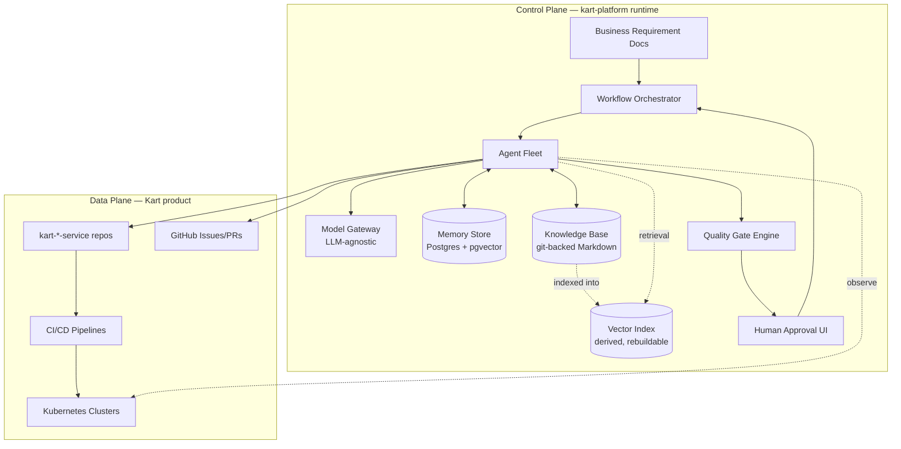

**Core design principle, stated once and referenced throughout:** *the knowledge base (git) is the source of truth; every index (vector store, memory cache, search facets) is a derived, rebuildable projection.* This is the same CQRS safety property the BRD already relies on for Kart's MongoDB read models (§7 of the BRD) — applied to the platform itself.

---

## 2. Repository Strategy

### 2.1 Recommendation: **Hybrid**

| Option | Verdict | Reasoning |
|---|---|---|
| Pure Monorepo | ❌ Rejected | Contradicts the BRD's own non-negotiable: "independent repository, independent deployment, independent CI/CD" per service. A monorepo makes that a *policy* enforced by tooling instead of a *structural* guarantee, and it's easy to erode under deadline pressure (one engineer imports another service's internal module "just this once"). |
| Pure Polyrepo | ❌ Rejected | No natural home for cross-cutting knowledge — architecture decisions, standards, the agent platform itself, and shared event contracts have no single place to live, versioned, and reviewed as a unit. Standards drift silently between 20 repos. |
| **Hybrid (recommended)** | ✅ | One **governance/knowledge/platform repo** (`kart-platform`) that owns no deployable product code, plus **one polyrepo per deployable unit** (true independent deploy), plus **one narrow contracts repo** (`kart-shared`) that is *consumed as a versioned package*, never as shared source. |

The hybrid model resolves the tension directly: independence is structural (separate repos, separate pipelines, separate on-call), while consistency is enforced by agents that read from one knowledge base and apply one set of standards across all of them — the same way a real platform/DX team would.

### 2.2 Validating & Improving Your Proposed List

Your list:

```
kart-platform, kart-order-service, kart-offer-service, kart-product-service,
kart-payment-service, kart-cart-service, kart-notification-service,
kart-search-service, kart-identity-service, kart-api-gateway, kart-infra,
kart-devops, kart-shared
```

**Issues found:**

1. **Missing `kart-inventory-service`.** The BRD names Inventory as the highest-contention service in the whole system (§5.2: `SELECT ... FOR UPDATE`, oversell prevention) and Order's Saga (§12) directly depends on it. It cannot be folded into Order or Payment — it needs independent scaling/locking characteristics. This is a gap, not a simplification — add it in Phase 1, not later.
2. **"Offer Service" is not one BRD service — it's a merge of three.** The BRD lists **Coupon**, **Pricing**, and **Promotion** as separate services (§2.1, §5.4). Merging them into one `kart-offer-service` is defensible (all three answer "what does this customer pay, and why") but it's a DDD decision that needs to be made explicitly, not accidentally — see §2.3 below. If you intend `kart-offer-service` to *be* that merge, keep it; if you meant something else (e.g., a marketplace "offers/listings" concept — relevant since the BRD's title mentions "e-commerce" generically), clarify before scaffolding.
3. **`kart-shared` is dangerous as named if it becomes a dumping ground.** It must contain only versioned, published artifacts (event schemas, OpenAPI contracts, truly generic cross-cutting libraries like a logging/tracing middleware or an `Outbox` base class) — never domain logic, never a service's internal types. Treat it like a public API with semver, not a shared `utils` folder. Consider renaming conceptually to "contracts + platform libs" even if the repo name stays `kart-shared`.
4. **Remaining 15 BRD services need a placement decision**, not silence. Missing from your list: User, Category, Wishlist, Review, Shipping, Delivery Tracking, Recommendation, Analytics, Admin. Building all 20 repos on day one is not realistic — phase them (see §2.4).

### 2.3 DDD Justification for the Offer Merge

| Service (BRD) | Core Concept | Merge Rationale |
|---|---|---|
| Pricing | Price computation, tax, currency | Shares the "what does the customer pay" ubiquitous language with Promotion/Coupon |
| Promotion | Campaigns, flash sales, bundles | Directly modifies the pricing computation — tight coupling in the domain, not just code |
| Coupon | Issuance, redemption, limits | A coupon is a targeted, code-gated promotion — same aggregate family |

**Verdict:** merging is a legitimate bounded-context decision *if and only if* the write model separates aggregates cleanly (`PricingQuote`, `Coupon`, `PromotionCampaign` as distinct aggregate roots sharing one bounded context, not one god-aggregate). Document this as ADR-0001 in `kart-platform` (see §3). If in practice Pricing needs to scale/deploy independently of Promotion (likely — pricing is on the hot read path, promotions are comparatively low-QPS admin-driven), split them later; the DDD Agent (§8) should flag this risk at design time rather than after the fact.

### 2.4 Target Repository List (Phased)

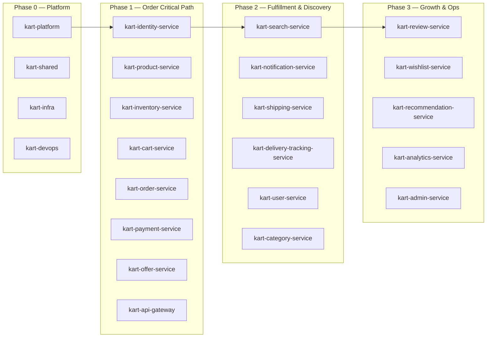

| Repo | Contains | Deploy Unit? |
|---|---|---|
| `kart-platform` | Docs, ADRs, standards, prompt library, agent defs, memory schema, orchestrator source | No (or: yes, as the orchestrator *service*, but its knowledge content is not a deployable) |
| `kart-shared` | Event JSON-Schemas, OpenAPI contracts, versioned NuGet packages (logging, tracing, outbox base, Result types) | Published as packages, not deployed |
| `kart-infra` | Terraform/Pulumi, Helm charts, K8s cluster bootstrap, network policies | Applied, not deployed |
| `kart-devops` | Reusable GitHub Actions workflows, pipeline templates, shared linters/scanners config | Consumed via `workflow_call` |
| `kart-<name>-service` × 20 | One per BRD service, each Clean Architecture + Vertical Slice, own DB, own pipeline | Yes |
| `kart-api-gateway` | Gateway routing/rate-limit config, BFF if needed | Yes |

### 2.5 GitHub Organization Structure (Free-Tier Operational Guide)

GitHub Free (personal or organization) has unlimited public **and** private repos, so repo *count* is never the constraint — the constraint is discipline: 24+ repos with no shared structure become unnavigable. This section is the concrete, buildable answer.

**Where repos live — two namespaces, not one:**

| Namespace | Holds | Why separate |
|---|---|---|
| A dedicated GitHub **Organization** (e.g. `kart-commerce`) | Every Kart-specific repo: `kart-platform`, `kart-requirements`, `kart-shared`, `kart-infra`, `kart-devops`, `kart-api-gateway`, all 18 `kart-<name>-service` repos | This is the product's home — same reason a real company puts its product repos under a company org, not an individual's personal account |
| The personal account (or a separate, neutral org later) | `agent-reusables` | It explicitly claims to be reusable "across every project, not just one product" (its own README) — housing it inside the Kart org would misrepresent it as Kart-specific and contradicts the same reusable-vs-business separation this whole platform is built on |

Creating an organization is free and gives you, at zero cost: an org-wide profile page, unlimited collaborators (useful the moment this stops being solo), and the org-wide features below — none of this is available to the same degree spread across unrelated personal-account repos.

**Naming — one rule, applied without exception:** `kart-<noun>-service` for every deployable microservice (already established in `agent-reusables/naming-conventions.md`'s generic `<org>-<noun>-service` pattern); everything else gets a `kart-<role>` name stating what it *is*, not what it does internally. All lowercase, hyphen-separated, no abbreviations that aren't already used elsewhere in this platform's docs.

**Complete repository list:**

| Repo | Role | Phase |
|---|---|---|
| `kart-platform` | Docs, ADRs, standards pointers, agent defs, pipeline registry | 0 |
| `kart-requirements` | BRD source of truth | 0 |
| `kart-shared` | Versioned event schemas, OpenAPI contracts, common libs | 0 |
| `kart-infra` | Terraform/Helm/K8s bootstrap | 0 |
| `kart-devops` | Reusable CI/CD workflows | 0 |
| `kart-identity-service`, `kart-product-service`, `kart-inventory-service`, `kart-cart-service`, `kart-order-service`, `kart-payment-service`, `kart-offer-service`, `kart-api-gateway` | Order-critical-path services + gateway | 1 |
| `kart-search-service`, `kart-notification-service`, `kart-shipping-service`, `kart-delivery-tracking-service`, `kart-user-service`, `kart-category-service` | Fulfillment & discovery services | 2 |
| `kart-review-service`, `kart-wishlist-service`, `kart-recommendation-service`, `kart-analytics-service`, `kart-admin-service` | Growth & ops services | 3 |

**Free-tier professional polish, all zero-cost:**

- **`.github` repo** (a repo literally named `.github` at the org root) — org-wide default issue templates, PR template, `CODEOWNERS`, `CONTRIBUTING.md`, `SECURITY.md`. Any repo without its own copy inherits these automatically — write once, apply to all 24+ repos instead of duplicating per repo.
- **Org profile README** — a repo named exactly the same as the org, with a `README.md`, renders as the org's public landing page (architecture summary, link to `kart-platform`'s docs, phase status).
- **Topics** on every repo (`kart`, `microservice`, `dotnet`, `phase-1`, plus a domain tag like `order-domain`) — free, and the only built-in way to filter/browse 24 repos by category from the org's repo list.
- **Branch protection + required PR review + required status checks** on every repo's `main` — enforces `git-workflow.md`'s "no direct commits to `main`" as a platform rule, not a promise.
- **`CODEOWNERS` per repo** — routes review requests automatically; pairs with the Quality Gate table's "Human approval required regardless of agent verdict" rule.
- **Dependabot** — free on every repo, catches vulnerable dependencies without waiting for a dedicated security tooling budget.
- **A single org-level Project (board)** — spans issues across all repos, which is what actually makes the Ticket/Sprint-Planner Agent output (§8.2 #7-8) usable at 24-repo scale instead of checking each repo's issue tab separately.
- **Reusable workflows via `kart-devops`** (`workflow_call`) — already planned in §2.4; this is the free-tier mechanism that avoids copy-pasting the same CI YAML into 24 repos.

**Visibility:** given this platform's own stated purpose ("doubles as interview prep," §1.2), default every repo to **public** — free either way on GitHub, but public also means Dependabot alerts and secret scanning run automatically (secret scanning push protection is a paid Advanced Security feature on private repos, free on public ones) and the org becomes a visible portfolio artifact. Flip a repo private only if it has a concrete reason (e.g., before it's presentable) — decide this per repo, not as a blanket default.

---

## 3. `kart-platform` Repository — Complete Design

```
kart-platform/
├── README.md
├── docs/
│   ├── PLATFORM_BLUEPRINT.md              # this document
│   ├── requirements/
│   │   ├── kart-requirements.md           # source BRD (raw, immutable once approved)
│   │   └── change-log.md                  # tracked amendments to the BRD, dated
│   ├── architecture/
│   │   ├── system-context.md              # C4 level 1
│   │   ├── container-diagram.md           # C4 level 2
│   │   ├── service-boundaries.md
│   │   └── capacity-plan.md
│   ├── ddd/
│   │   ├── ubiquitous-language.md         # cross-service glossary — single term ownership
│   │   ├── bounded-contexts.md
│   │   └── context-map.md                 # upstream/downstream, ACL, conformist, etc.
│   ├── adr/
│   │   ├── 0000-adr-template.md
│   │   ├── 0001-offer-service-merge.md
│   │   ├── 0002-hybrid-repo-strategy.md
│   │   └── ...
│   ├── standards/                         # see §15 in full
│   │   ├── naming-conventions.md
│   │   ├── folder-structure.md
│   │   ├── git-workflow.md
│   │   ├── api-standards.md
│   │   ├── event-standards.md
│   │   ├── database-standards.md
│   │   ├── observability-standards.md
│   │   ├── security-standards.md
│   │   └── testing-standards.md
│   ├── services/
│   │   └── <service-name>/
│   │       ├── requirement-spec.md
│   │       ├── architecture.md
│   │       ├── ddd-model.md
│   │       ├── api-contract.md            # mirrors published OpenAPI in kart-shared
│   │       ├── event-contract.md
│   │       ├── database-design.md
│   │       └── decisions.md               # service-local ADR log
│   └── runbooks/
│       ├── incident-response.md
│       └── rollback-procedures.md
├── knowledge-base/                        # the RAG corpus root — see §6
│   ├── index.manifest.json                # tracked chunk/embedding metadata (regenerable)
│   └── .gitignore                         # vector index artifacts are NOT committed
├── memory/                                # structured memory — see §5 (schema only; data lives in Postgres)
│   ├── schema/
│   │   ├── project-memory.schema.json
│   │   ├── architecture-memory.schema.json
│   │   ├── business-rule-memory.schema.json
│   │   ├── api-memory.schema.json
│   │   ├── database-memory.schema.json
│   │   ├── decision-memory.schema.json
│   │   ├── event-memory.schema.json
│   │   └── coding-memory.schema.json
│   └── seed/                              # bootstrap facts extracted from the BRD at platform init
├── prompts/                               # see §7
│   ├── library/
│   │   ├── requirement-analysis.prompt.md
│   │   ├── architecture.prompt.md
│   │   ├── ddd.prompt.md
│   │   ├── database-design.prompt.md
│   │   ├── api-design.prompt.md
│   │   ├── event-design.prompt.md
│   │   ├── coding.prompt.md
│   │   ├── code-review.prompt.md
│   │   ├── security-review.prompt.md
│   │   ├── testing.prompt.md
│   │   ├── documentation.prompt.md
│   │   ├── refactoring.prompt.md
│   │   └── bug-fixing.prompt.md
│   └── partials/                          # shared fragments (persona header, output-format footer)
│       ├── _persona.md
│       ├── _output-contract.md
│       └── _guardrails.md
├── agents/                                # see §8 — one definition file per agent, model-agnostic
│   ├── registry.yaml                      # agent name → definition file → default model tier
│   ├── requirement-agent.yaml
│   ├── architecture-agent.yaml
│   ├── ddd-agent.yaml
│   ├── api-design-agent.yaml
│   ├── database-design-agent.yaml
│   ├── event-design-agent.yaml
│   ├── ticket-agent.yaml
│   ├── sprint-planner-agent.yaml
│   ├── scaffold-agent.yaml
│   ├── coding-agent.yaml
│   ├── code-review-agent.yaml
│   ├── security-review-agent.yaml
│   ├── testing-agent.yaml
│   ├── bug-fix-agent.yaml
│   ├── documentation-agent.yaml
│   ├── memory-update-agent.yaml
│   ├── docker-agent.yaml
│   ├── cicd-agent.yaml
│   ├── deployment-agent.yaml
│   ├── monitoring-agent.yaml
│   ├── orchestrator-agent.yaml
│   ├── contract-compatibility-agent.yaml
│   ├── knowledge-curator-agent.yaml
│   └── incident-rollback-agent.yaml
├── workflows/                             # dependency-graph DAG definitions — see §9
│   ├── new-service.workflow.yaml
│   ├── new-feature.workflow.yaml
│   ├── bug-fix.workflow.yaml
│   └── hotfix.workflow.yaml
├── model-gateway/                         # LLM-agnostic abstraction — see §8.1
│   ├── providers/
│   │   ├── provider.interface.ts (or .cs)
│   │   ├── anthropic.provider.ts
│   │   ├── openai.provider.ts
│   │   ├── local.provider.ts               # Ollama/vLLM for air-gapped or cost-sensitive tiers
│   │   └── registry.ts
│   └── config/
│       ├── models.yaml                     # model tiers → provider + model id, per environment
│       └── routing.yaml                    # agent → tier mapping (cheap/fast vs frontier)
├── templates/                              # scaffold seeds consumed by Project Scaffold Agent
│   ├── service-template-dotnet/
│   │   ├── src/
│   │   │   ├── Api/
│   │   │   ├── Application/                # vertical slices live here
│   │   │   ├── Domain/
│   │   │   └── Infrastructure/
│   │   ├── tests/
│   │   ├── Dockerfile
│   │   └── .github/workflows/ci.yml
│   └── github-issue-templates/
│       ├── epic.md
│       ├── story.md
│       └── task.md
├── orchestrator/                          # the workflow engine runtime source (if self-hosted)
└── tools/                                 # CLI: `kart-cli run-workflow`, `kart-cli index-kb`, etc.
```

**Key decisions embedded in this structure:**

- `docs/services/<name>/` is the per-service *design record*, populated by agents, reviewed by humans, and it is what agents retrieve against for that service — not the code repo itself. Code repos stay lean; design history stays in one place.
- `memory/` holds **schemas only**; actual memory rows live in Postgres (`kart-platform` doesn't become a database itself, but owns the schema-as-code and migration history for the memory store).
- `knowledge-base/index.manifest.json` is committed (so a `git diff` shows what changed and needs re-embedding); the actual vectors are not committed — they are a rebuildable derived artifact, consistent with §1's core principle.

---

## 4. Knowledge Architecture

Three knowledge tiers, each with a different volatility and a different retrieval path:

| Tier | Examples | Volatility | Storage | Retrieval |
|---|---|---|---|---|
| **Canonical Knowledge** | BRD, standards, ADRs, ubiquitous language | Low (changes via PR + review) | `docs/` in git | RAG (semantic + metadata filter) |
| **Working Knowledge** | Per-service design docs, open tickets, sprint plan | Medium (changes per sprint) | `docs/services/<name>/`, GitHub Issues API | RAG + direct API |
| **Living Memory** | Decisions made, bugs fixed, patterns that worked/failed | High (changes per agent run) | Postgres memory tables (§5) | Structured query + semantic recall |

ADRs are the connective tissue: every non-trivial agent decision (a DDD boundary call, a merge like Offer Service, a rejected alternative) becomes an ADR file, which is both human-readable governance *and* a first-class RAG document with strong metadata (service, date, status: proposed/accepted/superseded).

---

## 5. Memory Architecture

All memory lives in Postgres (`kart_memory` database — yes, this one platform database is allowed to be shared, since it is control-plane, not product data) with `pgvector` for semantic recall on top of structured columns. Every row carries `service_id`, `created_by_agent`, `created_at`, `source_ref` (a link back to the git commit/PR/ticket that produced it), and `superseded_by` (nullable self-reference) so memory is append-only and auditable, never silently overwritten.

| Memory Layer | Stores | Written By | Updated When | Read By |
|---|---|---|---|---|
| **Project Memory** | Active sprints, service inventory, phase status, team assignments | Sprint Planner Agent, Orchestrator | Every sprint planning cycle | Orchestrator, Ticket Agent |
| **Architecture Memory** | Service boundaries, container diagrams, dependency graph edges | Architecture Agent | On new service or boundary change | Architecture Agent (self-consistency check), DDD Agent |
| **Business Rule Memory** | Domain invariants ("inventory must never oversell", "payment idempotency required") | Requirement Agent, DDD Agent | On new/changed BRD section | Coding Agent, Testing Agent, Code Review Agent |
| **API Memory** | Published contract versions, deprecation timelines, consumer registry | API Design Agent, Contract Compatibility Agent | On contract publish/change | Contract Compatibility Agent, Coding Agent |
| **Database Memory** | Schema versions, index rationale, partitioning/sharding keys chosen and why | Database Design Agent | On migration merge | Database Design Agent (future changes), Code Review Agent |
| **Decision Memory** | ADRs, rejected alternatives, trade-off reasoning | Architecture Agent, DDD Agent, human reviewers | On ADR merge | All design-time agents (to avoid re-litigating settled decisions) |
| **Event Memory** | Event catalog, schema versions, producer/consumer graph, retry/DLQ policy per event | Event Design Agent | On new/changed event | Coding Agent, Testing Agent, Contract Compatibility Agent |
| **Coding Memory** | Patterns that passed review, patterns that were rejected and why, recurring review comments per service | Code Review Agent, Memory Update Agent | After every merged/rejected PR | Coding Agent (few-shot grounding), Code Review Agent |

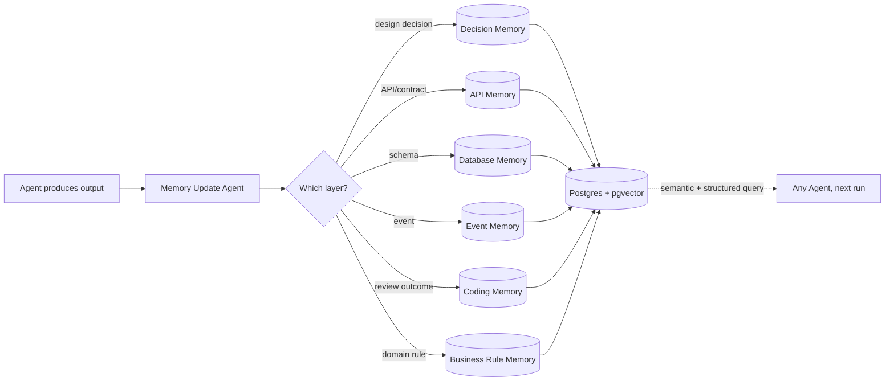

**Update discipline:** no agent writes memory directly — every agent's output is handed to the **Memory Update Agent**, which is the only writer. This mirrors the Outbox pattern (single writer, consistent shape) and prevents 24 agents from developing 24 slightly different memory-write conventions.

---

## 6. Context Retrieval Architecture (RAG Engine)

**Goal restated:** agents must never load the whole repo. Retrieval must be precise, cheap, and consistent across runs.

### 6.1 Indexing Pipeline

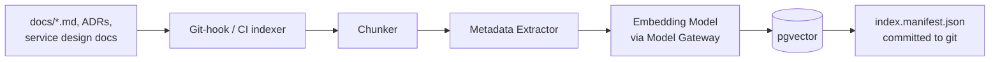

Indexing runs as a CI step on every merge to `kart-platform` (and on doc updates in each service repo, via a shared reusable workflow from `kart-devops`) — never on-demand mid-agent-run. This keeps agent latency independent of indexing cost and guarantees the index reflects only *reviewed, merged* knowledge, not in-flight drafts.

### 6.2 Chunking Strategy

| Document Type | Chunk Unit | Rationale |
|---|---|---|
| ADRs | Whole document (typically <1 page) | Decisions must not be split mid-reasoning |
| Standards docs | Per H2/H3 section | Each convention (e.g., "naming: events") is independently retrievable |
| Service design docs | Per H2 section + always attach the doc's front-matter (service name, status) | Keeps "API contract" separate from "database design" for the same service |
| BRD | Per numbered section (already numbered 1–28) | Matches the document's own semantic boundaries — no re-derivation needed |
| Event/API contracts (JSON/YAML) | Per event/per endpoint | Smallest independently-meaningful unit |
| Code (when later indexed for the Coding Agent) | Per function/class (AST-aware, not line-window) | Avoids truncating a function mid-body |

Target chunk size: 200–500 tokens, with a 1-sentence "chunk summary" prepended (generated once at index time, not at query time) to improve embedding quality without inflating query-time cost.

### 6.3 Embedding Strategy

- Embeddings are generated via the **Model Gateway** (§8.1), not a hardcoded provider — swapping embedding models is a config change, same as swapping the reasoning LLM.
- Default: a strong open-weight embedding model runnable locally (e.g., a BGE/E5-class model) so indexing cost doesn't scale with frontier-API pricing and the index isn't vendor-locked.
- **Re-embedding discipline:** `index.manifest.json` stores a content hash per chunk. Only changed chunks are re-embedded on each CI run — this is the same "unpublished rows" idea as the Outbox poller (§11 of the BRD), applied to indexing.

### 6.4 Metadata Strategy

Every chunk carries:

```json
{
  "doc_type": "adr | standard | service-doc | brd-section | event-contract | api-contract",
  "service": "offer-service | null (platform-wide)",
  "status": "draft | approved | superseded",
  "layer": "architecture | ddd | api | database | event | coding",
  "version": "git commit sha of last change",
  "superseded_by": null
}
```

Metadata is *mandatory*, not inferred — the indexer rejects a doc missing front-matter. This is what makes retrieval cheap: a query almost always filters by `service` + `layer` before it ever does a vector similarity search, cutting the candidate set by 1–2 orders of magnitude before ranking.

### 6.5 Retrieval Strategy

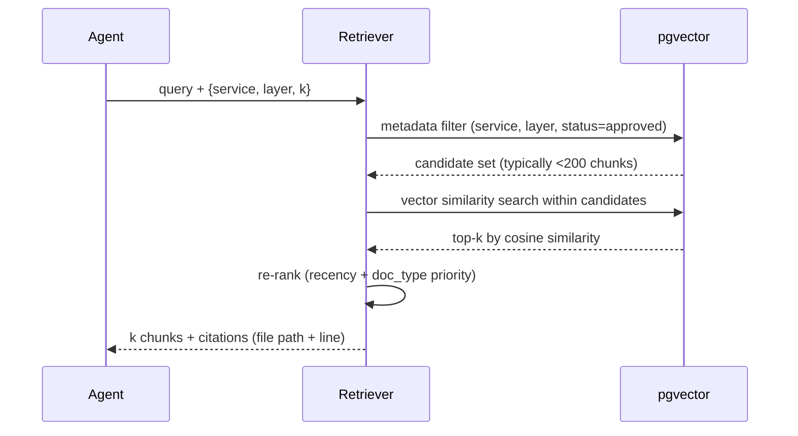

Two-stage retrieval (metadata filter → vector search within the filtered set) is what keeps token usage minimal: agents ask for "Database Memory + Coding Memory scoped to `offer-service`," not "everything about offers."

### 6.6 Ranking Strategy

Final ranking score = weighted blend, not pure cosine similarity:

| Signal | Weight | Why |
|---|---|---|
| Cosine similarity | 0.5 | Base relevance |
| Doc type priority (ADR > standard > design doc > raw BRD) | 0.2 | Decisions should outrank exploratory prose |
| Recency (newer supersedes older within same topic) | 0.2 | Superseded decisions must not resurface |
| Explicit pin (a human/agent marked a doc "always include for this service") | 0.1 override | Escape hatch for known-critical context (e.g., the oversell invariant must always ground Inventory work) |

### 6.7 Prompt Building Strategy

```
[Persona partial]                 <- from prompts/partials/_persona.md
[Task instructions]               <- from the specific prompt template
[Retrieved context: k chunks]     <- each with a citation header (file:section)
[Relevant memory: structured]     <- e.g., Business Rule Memory rows, not prose
[Output contract]                 <- from prompts/partials/_output-contract.md (schema/format)
[Guardrails]                      <- from prompts/partials/_guardrails.md
```

Context budget is enforced per agent (configured in `agents/registry.yaml`, e.g., 8K tokens for Ticket Agent, 32K for Architecture Agent) — if retrieval returns more than the budget, the ranker's cutoff wins, not truncation mid-document.

---

## 7. Prompt Architecture (Prompt Library)

Prompts are **modular templates + partials**, composed at runtime, versioned in git, and never hardcoded inside agent code — this is what makes an agent's *behavior* auditable and reviewable via PR, same as code.

```
prompts/
├── partials/
│   ├── _persona.md          # role framing, tone, non-negotiables (e.g., "never invent an API you didn't retrieve")
│   ├── _output-contract.md  # per-agent: JSON schema or Markdown structure expected back
│   └── _guardrails.md       # refuse-if conditions, escalate-to-human triggers
└── library/
    └── <domain>.prompt.md   # {{variables}} for task, retrieved_context, memory_snapshot
```

Example structure of one template file (illustrative, not exhaustive):

```markdown
---
name: ddd
used_by: [ddd-agent]
inputs: [service_name, requirement_spec, architecture_doc, ubiquitous_language]
output_schema: ddd-model.schema.json
---
{{> _persona}}

## Task
Given the requirement spec and architecture boundary for {{service_name}},
produce a DDD model: aggregates, entities, value objects, domain events,
and invariants. Reuse terms from the ubiquitous language glossary verbatim;
flag any new term you introduce as a proposed glossary addition.

## Retrieved Context
{{retrieved_context}}

## Relevant Memory
{{memory_snapshot}}

{{> _output-contract}}
{{> _guardrails}}
```

| Template | Consumed By |
|---|---|
| `requirement-analysis` | Requirement Agent |
| `architecture` | Architecture Agent |
| `ddd` | DDD Agent |
| `database-design` | Database Design Agent |
| `api-design` | API Design Agent |
| `event-design` | Event Design Agent |
| `coding` | Coding Agent |
| `code-review` | Code Review Agent |
| `security-review` | Security Review Agent |
| `testing` | Testing Agent |
| `documentation` | Documentation Agent |
| `refactoring` | Coding Agent (refactor mode) |
| `bug-fixing` | Bug Fix Agent |

Reusability rule: a template never embeds a service name or hardcoded business rule — those arrive as `{{variables}}` or retrieved context. This is what lets the same 13 templates serve all 20 Kart services and every future project built on this platform.

---

## 8. Agent Architecture

### 8.1 LLM-Agnostic Model Gateway (the non-negotiable requirement)

No agent ever calls a provider SDK directly. Every agent calls one internal interface:

```mermaid
graph TB
    AGENT[Any Agent] --> GW[Model Gateway]
    GW --> IFACE{{ModelProvider interface:<br/>complete(), streamComplete(),<br/>embed(), supportsTools(),<br/>contextWindow()}}
    IFACE --> ANTH[Anthropic Provider]
    IFACE --> OAI[OpenAI Provider]
    IFACE --> GEM[Gemini Provider]
    IFACE --> LOCAL[Local/OSS Provider<br/>vLLM/Ollama]
    GW --> ROUTE[routing.yaml:<br/>agent → model tier]
    ROUTE --> TIER1[Tier: cheap/fast]
    ROUTE --> TIER2[Tier: frontier/reasoning]
    ROUTE --> TIER3[Tier: local/air-gapped]
```

- `ModelProvider` interface is the only contract agents know about: `complete(prompt, tools?) -> response`, `embed(text) -> vector`, plus capability flags (`supportsTools`, `contextWindow`, `supportsStructuredOutput`).
- `models.yaml` maps a **tier name** (not a provider) to an actual provider+model+API key reference, per environment. Agents request a tier (e.g., `reasoning-heavy` for Architecture Agent, `fast-cheap` for Ticket Agent), never a vendor.
- Swapping the underlying LLM for the whole platform, or for one agent, is a one-line change in `routing.yaml`. No agent code changes, no prompt changes (prompts are provider-neutral Markdown, not vendor-specific formats — the provider adapter handles any vendor-specific message formatting).
- Structured output (JSON schema enforcement) is normalized at the adapter layer so an agent's `output_schema` contract holds regardless of whether the underlying provider natively supports function-calling/JSON-mode or needs a prompted fallback + validator retry.

### 8.2 Agent Catalog

Every agent follows this contract. Full table below; the Offer Service walkthrough in §10 shows them wired together.

#### 1. Requirement Agent
| Field | Detail |
|---|---|
| Purpose | Turn a raw BRD section into a structured, service-scoped requirement spec |
| Input | BRD chunk(s), target service name |
| Output | `requirement-spec.md` (functional reqs, NFRs, domain rules extracted) |
| Responsibilities | Disambiguate scope; flag missing NFRs; extract domain invariants into Business Rule Memory |
| Dependencies | None upstream (entry point) |
| Tools | RAG retriever, Memory Update Agent (hand-off) |
| Memory Used | Project Memory (read), Business Rule Memory (write via hand-off) |
| Failure Conditions | Ambiguous/contradictory requirement; missing NFR category |
| Retry Strategy | Escalate to human with specific question, not blind retry |
| Human Approval Required | Yes — spec sign-off before Architecture Agent proceeds |

#### 2. Architecture Agent
| Field | Detail |
|---|---|
| Purpose | Place the service in the system, define its boundary and dependencies |
| Input | Approved requirement spec, current Architecture Memory (existing service graph) |
| Output | `architecture.md`, updated container diagram, dependency graph edges |
| Responsibilities | Boundary rationale; identify sync vs async dependencies; flag distributed-monolith risk |
| Dependencies | Requirement Agent |
| Tools | RAG retriever, diagram generator (Mermaid) |
| Memory Used | Architecture Memory (read/write), Decision Memory (read) |
| Failure Conditions | Proposed boundary conflicts with an existing bounded context |
| Retry Strategy | Re-run with conflict explicitly injected into context; escalate after 1 failed retry |
| Human Approval Required | Yes — Architecture Review Board gate |

#### 3. DDD Agent
| Field | Detail |
|---|---|
| Purpose | Model aggregates, entities, value objects, domain events, invariants |
| Input | Approved architecture doc, ubiquitous language glossary |
| Output | `ddd-model.md`, glossary additions (proposed) |
| Responsibilities | Enforce aggregate consistency boundaries; reuse existing glossary terms; propose new terms explicitly |
| Dependencies | Architecture Agent |
| Tools | RAG retriever |
| Memory Used | Business Rule Memory (read), Decision Memory (read/write) |
| Failure Conditions | Aggregate boundary crosses a transaction boundary incorrectly |
| Retry Strategy | One self-critique pass before human escalation |
| Human Approval Required | Yes |

#### 4. API Design Agent
| Field | Detail |
|---|---|
| Purpose | Produce OpenAPI/gRPC contract for the service |
| Input | DDD model, API standards doc |
| Output | `api-contract.yaml` (OpenAPI), published draft to `kart-shared` |
| Responsibilities | Versioning per API standards; idempotency-key requirement on money-moving endpoints |
| Dependencies | DDD Agent |
| Tools | OpenAPI linter |
| Memory Used | API Memory (read/write) |
| Failure Conditions | Breaking change vs an existing consumer contract |
| Retry Strategy | Route to Contract Compatibility Agent before retry |
| Human Approval Required | Yes, if breaking change detected; otherwise auto-approved on lint pass |

#### 5. Database Design Agent
| Field | Detail |
|---|---|
| Purpose | Design write (PostgreSQL) and read (MongoDB) schemas |
| Input | DDD model, database standards |
| Output | `database-design.md`, migration scripts (draft) |
| Responsibilities | Indexing rationale, partitioning/sharding key choice, denormalization decisions for read model |
| Dependencies | DDD Agent |
| Tools | Schema linter, migration diff tool |
| Memory Used | Database Memory (read/write) |
| Failure Conditions | Missing index for a documented query pattern; sharding key causes hotspot |
| Retry Strategy | Self-critique against Database Memory of past hotspot incidents |
| Human Approval Required | Yes for write-model schema; no for read-model projection changes |

#### 6. Event Design Agent
| Field | Detail |
|---|---|
| Purpose | Define domain events, schemas, retry/DLQ policy |
| Input | DDD model, event standards, existing Event Catalog |
| Output | Event schema files, `event-contract.md`, DLQ/retry policy assignment |
| Responsibilities | Naming convention compliance; assign retry budget by criticality (money-moving = highest) |
| Dependencies | DDD Agent |
| Tools | Schema registry validator |
| Memory Used | Event Memory (read/write) |
| Failure Conditions | Event name collision; schema incompatible with an existing consumer |
| Retry Strategy | Route to Contract Compatibility Agent |
| Human Approval Required | Yes |

#### 7. Ticket Agent
| Field | Detail |
|---|---|
| Purpose | Decompose approved design into GitHub Issues |
| Input | Approved design package (architecture + DDD + API + event + DB docs) |
| Output | Epics/Stories/Tasks created in the target repo |
| Responsibilities | Right-size tasks (vertical slice per task); link dependencies between issues |
| Dependencies | All design agents (post human approval gate) |
| Tools | GitHub API, issue templates |
| Memory Used | Project Memory (write) |
| Failure Conditions | Design package incomplete (missing a required doc) |
| Retry Strategy | Block and request missing artifact, no blind retry |
| Human Approval Required | No (mechanical decomposition), but PM can edit before sprint assignment |

#### 8. Sprint Planner Agent
| Field | Detail |
|---|---|
| Purpose | Sequence and assign tickets to sprints by dependency and capacity |
| Input | Ticket set, team capacity config, dependency graph |
| Output | Sprint plan (assigned issues, sequencing) |
| Responsibilities | Respect the dependency DAG (§10); flag over-capacity sprints |
| Dependencies | Ticket Agent |
| Tools | GitHub Projects API |
| Memory Used | Project Memory (read/write) |
| Failure Conditions | Circular dependency in ticket graph |
| Retry Strategy | Surface cycle to human, cannot self-resolve |
| Human Approval Required | Yes — PM approves sprint plan |

#### 9. Project Scaffold Agent
| Field | Detail |
|---|---|
| Purpose | Generate the initial repo from platform templates |
| Input | Service name, chosen template (`service-template-dotnet`), approved architecture doc |
| Output | Initial commit to new `kart-<name>-service` repo (Clean Architecture + Vertical Slice skeleton, Dockerfile, CI stub) |
| Responsibilities | Wire in standards (linting config, CI templates from `kart-devops`) |
| Dependencies | Sprint Planner Agent (repo created at start of first sprint) |
| Tools | Git, GitHub API, template engine |
| Memory Used | Coding Memory (read, for template conventions) |
| Failure Conditions | Repo name collision; template version mismatch |
| Retry Strategy | Fail closed, no auto-retry on repo creation |
| Human Approval Required | No (mechanical), audited via commit |

#### 10. Coding Agent
| Field | Detail |
|---|---|
| Purpose | Implement a vertical slice per ticket |
| Input | Ticket, API/DB/Event contracts, coding standards, relevant Coding Memory |
| Output | Pull Request |
| Responsibilities | Implement to contract; write inline tests; follow standards |
| Dependencies | Project Scaffold Agent, relevant design docs |
| Tools | Repo read/write, test runner, RAG retriever |
| Memory Used | Coding Memory (read heavily), Business Rule Memory (read) |
| Failure Conditions | Contract ambiguous; test infra missing |
| Retry Strategy | Up to 2 self-correction passes against static analysis/test failures, then escalate |
| Human Approval Required | No to open PR; yes to merge (via Code Review + human gate) |

#### 11. Code Review Agent
| Field | Detail |
|---|---|
| Purpose | Automated first-pass review against standards |
| Input | PR diff, coding standards, Coding Memory (past review patterns) |
| Output | Review comments, approve/request-changes verdict |
| Responsibilities | Enforce standards; flag reuse/simplification opportunities; not a rubber stamp |
| Dependencies | Coding Agent |
| Tools | Static analyzer, RAG retriever |
| Memory Used | Coding Memory (read/write) |
| Failure Conditions | Cannot determine standard applicability (ambiguous convention) |
| Retry Strategy | N/A — reports findings once, human decides |
| Human Approval Required | Yes — human reviewer has final say, agent is advisory |

#### 12. Security Review Agent
| Field | Detail |
|---|---|
| Purpose | SAST, secret scanning, dependency vulnerability scan |
| Input | PR diff, dependency manifest |
| Output | Security report (pass/fail + findings) |
| Responsibilities | Block on critical/high findings; check idempotency-key + auth requirements on sensitive endpoints |
| Dependencies | Coding Agent |
| Tools | SAST scanner, secret scanner, SCA tool |
| Memory Used | Business Rule Memory (read, for security invariants) |
| Failure Conditions | Scanner unavailable/timeout |
| Retry Strategy | Retry scan once; if infra failure persists, block merge (fail closed) |
| Human Approval Required | Yes for any critical/high finding override |

#### 13. Testing Agent
| Field | Detail |
|---|---|
| Purpose | Generate/execute unit, integration, and contract tests |
| Input | Implementation PR, API/event contracts |
| Output | Test report (coverage, pass/fail), new test files |
| Responsibilities | Contract test against `kart-shared` published schemas; enforce coverage gate |
| Dependencies | Coding Agent |
| Tools | Test runner, contract-test framework (e.g., Pact-style) |
| Memory Used | Coding Memory (read) |
| Failure Conditions | Flaky test detected; coverage below threshold |
| Retry Strategy | Re-run flaky tests up to 3x before flagging as flaky (not blocking) vs failing |
| Human Approval Required | No, gate is automatic pass/fail |

#### 14. Bug Fix Agent
| Field | Detail |
|---|---|
| Purpose | Reproduce and fix a reported defect |
| Input | Bug report/ticket, relevant service code, logs/traces if available |
| Output | Pull Request with fix + regression test |
| Responsibilities | Root-cause before patching; add regression test; never silence a failing test to pass CI |
| Dependencies | Monitoring Agent or human bug report |
| Tools | Repo access, log/trace query, test runner |
| Memory Used | Coding Memory (read/write — record recurring bug patterns) |
| Failure Conditions | Cannot reproduce |
| Retry Strategy | Escalate to human with repro attempts documented, do not guess-patch |
| Human Approval Required | Yes to merge |

#### 15. Documentation Agent
| Field | Detail |
|---|---|
| Purpose | Keep service README, API docs, ADRs current |
| Input | Merged PR diff, design docs |
| Output | Updated docs in `docs/services/<name>/` and service repo README |
| Responsibilities | Docs-as-code — no doc update, no merge (enforced as a gate) |
| Dependencies | Coding Agent (post-merge) |
| Tools | RAG retriever, doc linter |
| Memory Used | Decision Memory (read) |
| Failure Conditions | Ambiguous what changed semantically vs cosmetically |
| Retry Strategy | Conservative default: document more, not less; human can trim |
| Human Approval Required | No, but reviewable in the same PR |

#### 16. Memory Update Agent
| Field | Detail |
|---|---|
| Purpose | Sole writer to all memory layers |
| Input | Any agent's structured output |
| Output | Memory rows (append-only, with `superseded_by` links) |
| Responsibilities | Classify output to correct memory layer; never overwrite, always version |
| Dependencies | Every agent (fan-in) |
| Tools | Postgres write access |
| Memory Used | All layers (write) |
| Failure Conditions | Ambiguous memory-layer classification |
| Retry Strategy | Default to Decision Memory + flag for human reclassification |
| Human Approval Required | No |

#### 17. Docker Agent
| Field | Detail |
|---|---|
| Purpose | Build and push container images |
| Input | Merged service code, Dockerfile from template |
| Output | Tagged image in registry |
| Responsibilities | Multi-stage build compliance; minimal final image; vulnerability scan of base image |
| Dependencies | Documentation Agent (post-merge, docs-gate passed) |
| Tools | Docker/BuildKit, registry API |
| Memory Used | Coding Memory (read, for Dockerfile conventions) |
| Failure Conditions | Build failure; base image CVE above threshold |
| Retry Strategy | Retry build once (transient registry errors); CVE failures block, no retry |
| Human Approval Required | No |

#### 18. CI/CD Agent
| Field | Detail |
|---|---|
| Purpose | Orchestrate the build→test→scan→push pipeline |
| Input | Repo event (merge to main) |
| Output | Pipeline run result | 
| Responsibilities | Enforce gate sequence (§11); halt pipeline on first failed gate |
| Dependencies | Docker Agent, Testing Agent, Security Review Agent |
| Tools | GitHub Actions / pipeline runner |
| Memory Used | Project Memory (read/write — pipeline status) |
| Failure Conditions | Any gate failure |
| Retry Strategy | Infra-failure retry (1x); logic-failure = no retry, report |
| Human Approval Required | No (gates already encode approval) |

#### 19. Deployment Agent
| Field | Detail |
|---|---|
| Purpose | Deploy to staging then production |
| Input | Passed pipeline artifact, Helm chart/K8s manifest |
| Output | Deployed environment, deployment record |
| Responsibilities | Canary/blue-green strategy per service criticality; staging before prod always |
| Dependencies | CI/CD Agent |
| Tools | kubectl/Helm, K8s API |
| Memory Used | Decision Memory (read, for deployment strategy per service) |
| Failure Conditions | Health check fails post-deploy |
| Retry Strategy | No retry — hand off to Incident/Rollback Agent immediately |
| Human Approval Required | Yes for production (Release Manager go/no-go); no for staging |

#### 20. Monitoring Agent
| Field | Detail |
|---|---|
| Purpose | Verify SLOs post-deployment; ongoing health observation |
| Input | Metrics/logs/traces from the deployed service |
| Output | Deployment Verification Report; ongoing alerts |
| Responsibilities | Compare against documented NFR targets (BRD §3); trigger rollback path on breach |
| Dependencies | Deployment Agent |
| Tools | Metrics/tracing backend query API |
| Memory Used | Business Rule Memory (read, for SLO targets), Decision Memory (write, incident record) |
| Failure Conditions | SLO breach within verification window |
| Retry Strategy | N/A — breach triggers Incident/Rollback Agent, not a retry |
| Human Approval Required | No to alert; yes to accept a documented SLO breach as non-blocking |

#### 21. Orchestrator Agent (meta-agent)
| Field | Detail |
|---|---|
| Purpose | Read the workflow DAG (§9) and dispatch the next agent(s) when dependencies are satisfied |
| Input | Workflow definition, current state of all steps |
| Output | Agent invocation events |
| Responsibilities | Enforce dependency ordering; parallelize independent branches; halt on gate failure |
| Dependencies | None (it's the scheduler) |
| Tools | Job queue, workflow state store |
| Memory Used | Project Memory (read/write) |
| Failure Conditions | Deadlock (circular wait) |
| Retry Strategy | Detect and alert, never silently drop a step |
| Human Approval Required | No (approval gates are steps in its graph, not decisions it makes itself) |

#### 22. Contract Compatibility Agent
| Field | Detail |
|---|---|
| Purpose | Validate a proposed API/event change against all known consumers before it's allowed to merge |
| Input | Proposed contract diff, API Memory + Event Memory (consumer registry) |
| Output | Compatibility report (breaking / non-breaking), consumer impact list |
| Responsibilities | Prevent the "distributed monolith via silent breaking change" failure mode across 20 independently-deployed repos |
| Dependencies | API Design Agent, Event Design Agent |
| Tools | Schema diff tool, consumer registry query |
| Memory Used | API Memory, Event Memory (read) |
| Failure Conditions | Consumer registry incomplete/stale |
| Retry Strategy | Fail closed — treat unknown consumers as "assume breaking" |
| Human Approval Required | Yes if breaking |

#### 23. Knowledge Curator Agent
| Field | Detail |
|---|---|
| Purpose | Periodic housekeeping of the knowledge base — dedup, mark superseded docs, flag stale ADRs |
| Input | Full knowledge base metadata (not content) |
| Output | Curation report + proposed PR (mark superseded, merge duplicates) |
| Responsibilities | Keep the RAG index precise over time; prevent knowledge rot |
| Dependencies | None (runs on a schedule, not the critical path) |
| Tools | RAG retriever, metadata query |
| Memory Used | Decision Memory (read) |
| Failure Conditions | Ambiguous duplicate (two docs disagree, not just overlap) |
| Retry Strategy | Escalate disagreements to human, only auto-merge true duplicates |
| Human Approval Required | Yes for supersession of an approved doc |

#### 24. Incident / Rollback Agent
| Field | Detail |
|---|---|
| Purpose | React to a failed Deployment Verification or a production incident |
| Input | Monitoring Agent breach report |
| Output | Rollback executed, incident record, paging notification |
| Responsibilities | Automatic rollback for defined severity thresholds; page human for ambiguous severity |
| Dependencies | Monitoring Agent, Deployment Agent |
| Tools | kubectl/Helm rollback, paging system |
| Memory Used | Decision Memory (write, incident + resolution) |
| Failure Conditions | Rollback itself fails |
| Retry Strategy | One rollback attempt, then immediate human page — never loop |
| Human Approval Required | No for auto-rollback on critical SLO breach (speed matters); yes for any manual override |

---

## 9. Workflow Engine

The Orchestrator Agent executes **workflow definitions** (`workflows/*.workflow.yaml`) — declarative DAGs, not hardcoded control flow, so a new workflow (e.g., `hotfix.workflow.yaml`, which skips the design-phase agents entirely) is a config change.

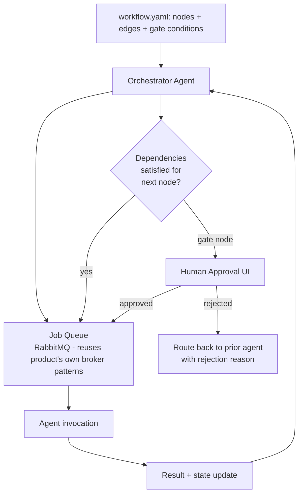

Each workflow node declares: `agent`, `inputs` (referencing prior node outputs or KB/memory queries), `depends_on`, and — if it's a gate — `approval_role`. The engine is intentionally the same shape as the product's own Saga orchestrator (BRD §12): forward steps + explicit compensation/rejection path back, not a silent retry loop.

---

## 10. Dependency Graph — Offer Service, Requirement → Production

This is the full worked example, using the Offer Service (Pricing + Promotion + Coupon merge, per §2.3/ADR-0001).

| Step | Agent | Input | Output | Depends On | Next |
|---|---|---|---|---|---|
| 1 | Requirement Agent | BRD §2.1/§5.4 (Pricing, Promotion, Coupon sections) | `offer-service/requirement-spec.md` | — | 2 |
| 2 | Architecture Agent | Requirement spec, Architecture Memory | `offer-service/architecture.md`, updated service graph | 1 | 3 |
| 3 | DDD Agent | Architecture doc, ubiquitous language | `offer-service/ddd-model.md` (aggregates: `PricingQuote`, `Coupon`, `PromotionCampaign`) | 2 | 4, 5, 6 |
| 4 | API Design Agent | DDD model | `offer-service/api-contract.yaml` (`POST /pricing/quote`, `POST /coupons/validate`, `GET /promotions/active`) | 3 | 7 |
| 5 | Database Design Agent | DDD model | `offer-service/database-design.md` (PG write schema + Mongo/Redis read models) | 3 | 7 |
| 6 | Event Design Agent | DDD model | Event schemas: `PriceQuoteIssued`, `CouponRedeemed`, `PromotionActivated`, `PromotionExpired` | 3 | 7 |
| 7 | Contract Compatibility Agent | Steps 4–6 outputs, API/Event Memory | Compatibility report | 4, 5, 6 | 8 |
| 8 | **Gate: Architecture Review Board (human)** | Full design package | Approved design package | 7 | 9 |
| 9 | Ticket Agent | Approved design package | GitHub Issues in `kart-offer-service` | 8 | 10 |
| 10 | Sprint Planner Agent | Ticket set | Sprint plan | 9 | 11 |
| 11 | **Gate: PM approval (human)** | Sprint plan | Approved sprint plan | 10 | 12 |
| 12 | Project Scaffold Agent | Approved architecture, `service-template-dotnet` | `kart-offer-service` repo initialized | 11 | 13 |
| 13 | Coding Agent | Ticket (per vertical slice) | PR per feature | 12 | 14 |
| 14 | **Gate: Static Analysis** | PR diff | Pass/fail | 13 | 15 |
| 15 | Code Review Agent | PR diff | Review verdict | 14 | 16 |
| 16 | Security Review Agent | PR diff | Security report | 14 | 16 |
| 17 | Testing Agent | PR diff, contracts | Test + contract-test report | 15, 16 | 18 |
| 18 | **Gate: Human PR approval (Tech Lead)** | Review + security + test results | Merge decision | 17 | 19 |
| 19 | Documentation Agent | Merged PR | Updated docs | 18 | 20 |
| 20 | Memory Update Agent | Steps 3–19 outputs | Memory rows written (Decision/API/DB/Event/Coding) | 19 | 21 |
| 21 | Docker Agent | Merged code | Tagged image | 19 | 22 |
| 22 | CI/CD Agent | Image + test/security results | Pipeline success | 21 | 23 |
| 23 | Deployment Agent (staging) | Pipeline artifact | Staging deployment | 22 | 24 |
| 24 | Testing Agent (E2E in staging) | Staging deployment | E2E report | 23 | 25 |
| 25 | **Gate: Release Manager go/no-go (human)** | E2E report | Go/no-go | 24 | 26 |
| 26 | Deployment Agent (production, canary) | Go decision | Production deployment | 25 | 27 |
| 27 | Monitoring Agent | Production traffic | Deployment Verification Report | 26 | 28 |
| 28 | Memory Update Agent | Verification outcome | Final memory record; workflow complete | 27 | — (loop closed) |
| — | Incident/Rollback Agent | Triggered only if step 27 breaches SLO | Auto-rollback + incident record | 27 (conditional) | back to 13 (hotfix branch) |

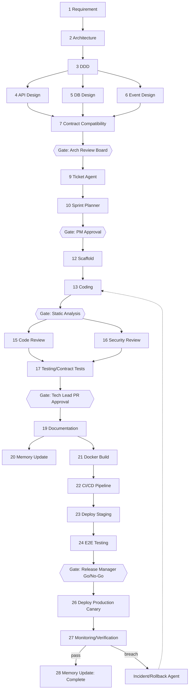

---

## 11. Quality Gates

| Gate | Blocks | Enforced By | Pass Criteria |
|---|---|---|---|
| Architecture Approval | Ticket creation | Human (Architecture Review Board) + Architecture Agent self-check | No unresolved boundary conflict |
| DDD Validation | API/DB/Event design | DDD Agent + human | Aggregates respect transaction boundaries; glossary consistent |
| Contract Compatibility | Merge to design-approved | Contract Compatibility Agent | No undeclared breaking change |
| Coding Standards | PR review | Code Review Agent + linter | Zero linter errors, standards doc compliance |
| Static Analysis | Code Review | CI static analyzer | No new critical/high findings |
| Security Scan | Merge | Security Review Agent | No critical/high CVE or SAST finding unresolved |
| Code Review | Merge | Human + Code Review Agent | Human approval required regardless of agent verdict |
| Unit Tests | Merge | Testing Agent | Coverage ≥ service-defined threshold, all pass |
| Integration Tests | Merge | Testing Agent | All pass against contract |
| Contract Tests | Merge | Testing Agent | Provider/consumer contract verified (Pact-style) |
| Performance Tests | Production deploy (as applicable) | Testing Agent (load-test mode) | Meets BRD §3 latency/throughput targets for the service tier |
| Documentation Updated | Merge | Documentation Agent (mechanical gate) | Docs diff present in same PR |
| Memory Updated | Pipeline completion | Memory Update Agent (mechanical gate) | Memory write confirmed before CI/CD proceeds |
| Docker Build Success | CI/CD | Docker Agent | Multi-stage build succeeds, base image scan clean |
| CI/CD Success | Deployment | CI/CD Agent | All prior gates green |
| Deployment Verification | Traffic ramp-up (canary → full) | Monitoring Agent | SLO metrics within budget during verification window |
| Rollback Strategy | N/A (always active) | Incident/Rollback Agent | Rollback executes within defined RTO if verification fails |

Gate ordering is fixed and enforced by the CI/CD Agent — a later gate can never run before an earlier one has passed; this is what prevents "security scan skipped because tests were slow" drift.

---

## 12. Repository Interaction Diagram

```mermaid
graph TB
    PLAT[kart-platform<br/>docs, agents, memory schema, prompts]
    SHARED[kart-shared<br/>event schemas, OpenAPI contracts, common libs]
    INFRA[kart-infra<br/>Terraform, Helm, K8s bootstrap]
    DEVOPS[kart-devops<br/>reusable CI/CD workflows]
    GW[kart-api-gateway]
    ORDER[kart-order-service]
    OFFER[kart-offer-service]
    INV[kart-inventory-service]
    PAY[kart-payment-service]

    PLAT -->|design docs consumed by agents| ORDER
    PLAT -->|design docs consumed by agents| OFFER
    PLAT -->|design docs consumed by agents| INV
    PLAT -->|design docs consumed by agents| PAY
    SHARED -->|versioned package/schema| ORDER
    SHARED -->|versioned package/schema| OFFER
    SHARED -->|versioned package/schema| INV
    SHARED -->|versioned package/schema| PAY
    DEVOPS -->|workflow_call| ORDER
    DEVOPS -->|workflow_call| OFFER
    DEVOPS -->|workflow_call| INV
    DEVOPS -->|workflow_call| PAY
    INFRA -->|Helm charts applied to| ORDER
    INFRA -->|Helm charts applied to| OFFER
    INFRA -->|Helm charts applied to| INV
    INFRA -->|Helm charts applied to| PAY
    GW --> ORDER
    ORDER --> INV
    ORDER --> PAY
    ORDER --> OFFER
```

No service repo ever imports another service repo's source. All cross-repo dependency is either (a) a versioned package from `kart-shared`, (b) a network call at runtime, or (c) a reusable pipeline from `kart-devops`. This is the structural guarantee that makes "independent deployment" real rather than aspirational.

---

## 13. Sequence Diagrams

### 13.1 End-to-End: BRD to Production (compressed view)

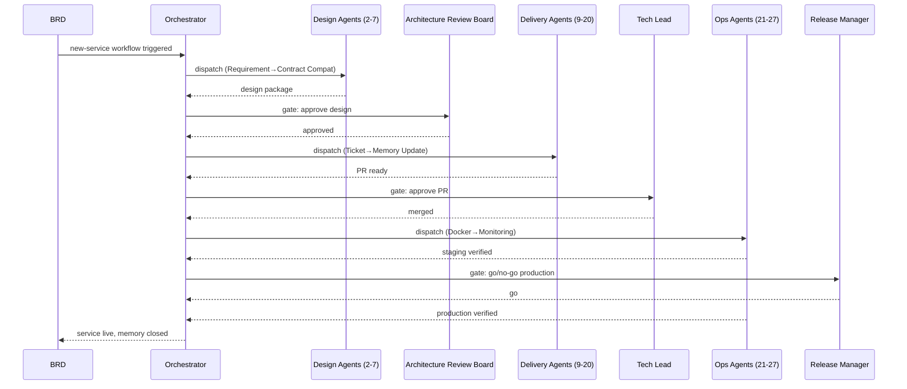

### 13.2 Human Rejection Path

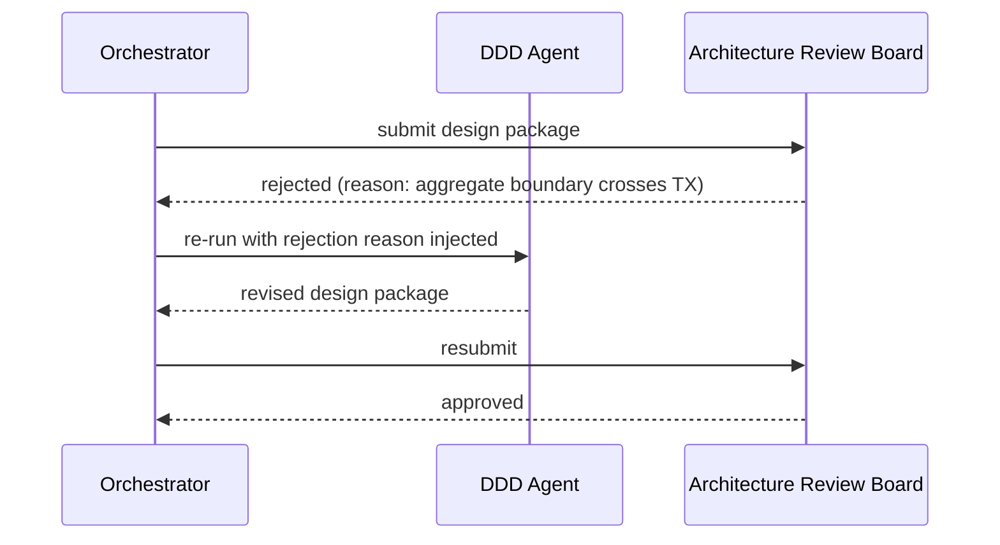

### 13.3 Retrieval at Query Time (any agent)

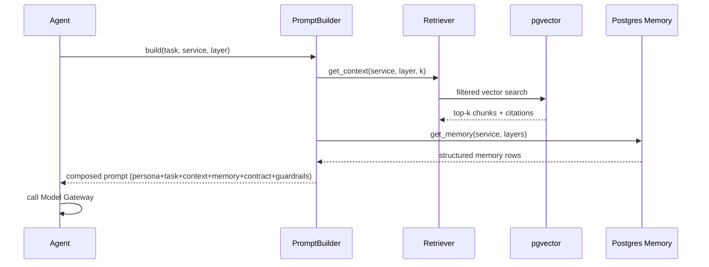

---

## 14. Agent Communication Flow

Agents do not call each other directly (no agent-to-agent RPC mesh) — they communicate exclusively through the Orchestrator's job queue and shared state (KB + Memory), the same decoupling principle the BRD applies to Kart's own services (topic exchange, publishers don't know consumers).

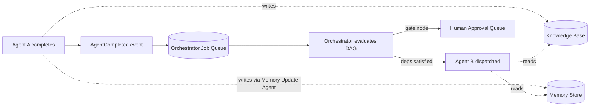

**Why this matters at 24-agent scale:** direct agent-to-agent calls would recreate the "distributed monolith" anti-pattern the BRD explicitly designed Kart to avoid (§5.1 boundary rationale) — inside the agent platform itself. Event-mediated, state-mediated communication keeps agents independently testable, replaceable, and re-runnable from any point (a single agent can be re-invoked with the same inputs it would have received, since those inputs are just KB/Memory queries, not another agent's live call).

---

## 15. Standards Catalog

| Standard | Key Rules (summary — full text lives in `docs/standards/*.md`) |
|---|---|
| **DDD** | One bounded context per repo; aggregates never span a DB transaction boundary; ubiquitous language terms owned by exactly one context, others reference via ACL |
| **CQRS** | Write model is always PostgreSQL, source of truth; read model always rebuildable from write model + event log; never write directly to a read model outside a projection consumer |
| **Naming** | Services: `kart-<noun>-service`; events: `<Entity><PastTenseVerb>` (e.g., `OrderCreated`); routing keys: `service.entity.action` |
| **Folder Structure** | Clean Architecture layers (`Api/Application/Domain/Infrastructure`) + Vertical Slices inside `Application` (one folder per use case, not one folder per technical layer) |
| **Clean Code / SOLID / Design Patterns** | SOLID as the non-negotiable baseline; constructor-injected dependencies only, no service locators; a reach-for-this pattern table (Strategy/Factory/Decorator/Specification/Mediator/Repository/Adapter) tied to the problem shape, not applied by default; DRY only after a third duplicate, never from two |
| **Logging** | Structured JSON only; mandatory fields: `traceId`, `service`, `level`, entity id relevant to the operation. Tooling: Serilog (structured JSON sink) + OpenTelemetry (trace/span injection) → Grafana Loki (aggregation/query), mandatory in every service, no substitutions without an ADR |
| **Observability** | RED metrics per service; W3C Trace Context propagated through HTTP and message headers; 100% trace coverage on the order path. Tooling: Prometheus (metrics) + Tempo (tracing) + Grafana (dashboards + alerting) — the Grafana LGTM stack, one OTel SDK across all services, mandatory in every service, no substitutions without an ADR |
| **Versioning** | Semantic Versioning for all published packages/contracts; API versioned via URL prefix (`/v1/`) |
| **Error Handling** | Result/Either pattern for domain errors, exceptions reserved for truly exceptional (infra) failures; no silent catch-and-continue |
| **Resilience** | Circuit breaker on every synchronous outbound call; bounded exponential-backoff retry on idempotent operations only; bulkhead isolation per dependency; explicit timeout budgets; degrade gracefully rather than cascade |
| **Validation** | FluentValidation (or equivalent) at the API boundary; domain invariants enforced in the aggregate, never only at the edge |
| **Caching** | Cache-aside default; write-through only when staleness is provably unacceptable (pricing/promotion flags); explicit invalidation on the relevant domain event, never TTL-only for price-sensitive data |
| **Security** | TLS everywhere; JWT validated at gateway + re-checked at service for sensitive scopes; no plaintext secrets, K8s Secrets + external secret manager |
| **AuthN/AuthZ** | OAuth2 Authorization Code (user-facing), Client Credentials (service-to-service); scope-based authorization |
| **REST** | Resource-oriented URLs, standard verbs/status codes, `Idempotency-Key` header mandatory on money-moving POSTs |
| **gRPC** | Reserved for internal high-throughput sync calls only (e.g., Inventory reserve check), never public-facing |
| **RabbitMQ** | Topic exchange convention per BRD §8; per-service DLQ; TTL-ladder retry, never immediate requeue-loop |
| **Kafka** | Adopted per-consumer-group via strangler migration (BRD §15), never wholesale; partition key = aggregate id for ordering |
| **Redis** | Cache-aside for reads, write-through for pricing/promo; key convention `service:entity:id[:shard]` |
| **MongoDB** | Denormalized read models; shard key chosen for even distribution + query locality, documented in Database Memory |
| **PostgreSQL** | Range partitioning for high-volume time-series tables (orders, events); explicit index rationale documented per table |
| **Data Access (ORM)** | EF Core (`Npgsql.EntityFrameworkCore.PostgreSQL`) is mandatory everywhere for Postgres access, no substitutions without an ADR; LINQ is the default query style; `DbContext` is the Unit of Work, no separate UoW abstraction on top of it; Dapper permitted only as a targeted escape hatch for read-heavy/reporting raw SQL, never as the default |
| **Repository Pattern** | One repository per Aggregate Root only, never generic per-entity/per-table repositories; repository's sole job is enforcing that persistence only happens through the aggregate boundary (load/save the whole aggregate, matches the DDD "aggregates never span a DB transaction boundary" rule) |
| **Docker** | Multi-stage builds mandatory; final image on minimal runtime base; dependency layer cached separately from source layer |
| **Kubernetes** | HPA on custom metrics (queue depth) where consumer-driven, not just CPU; ConfigMap for non-secret config, Secret for credentials |
| **Git** | Trunk-based with short-lived feature branches; no direct commits to `main` |
| **GitHub Flow** | `main` always deployable; PR required for every change; squash-merge default |
| **Branch Naming** | `<type>/<ticket-id>-<short-desc>` (e.g., `feat/OFF-142-coupon-redemption`) |
| **Commit Convention** | Conventional Commits (`feat:`, `fix:`, `refactor:`, `docs:`, etc.) |
| **Testing Convention** | Unit tests colocated with the vertical slice; integration tests in a separate project; contract tests run against published `kart-shared` schemas |
| **Documentation Convention** | Docs-as-code, Markdown, updated in the same PR as the change they describe |
| **ADR Convention** | One decision per file, immutable once accepted (supersede, never edit); status field mandatory (`proposed/accepted/superseded`) |
| **API Versioning** | Additive changes = minor, non-breaking within a major; breaking change = new major version path, old version deprecated on a documented timeline |
| **Semantic Versioning** | Applies to all `kart-shared` packages: MAJOR.MINOR.PATCH, breaking = MAJOR |

---

## 16. Future Scalability Roadmap

| Horizon | Platform Capability Added |
|---|---|
| **Now (Phase 0–1)** | Human-in-the-loop at every gate; single-project (Kart) knowledge base; pgvector RAG; RabbitMQ-equivalent job queue for agent dispatch |
| **Near-term** | Reduce human gates for low-risk changes (e.g., auto-approve non-breaking read-model changes); Knowledge Curator Agent runs on schedule; multi-service parallel workflows (Phase 2/3 services built concurrently) |
| **Mid-term** | Multi-project support — `kart-platform`'s agent/prompt/memory architecture becomes project-agnostic (a second product reuses the same platform with its own KB namespace); dedicated vector DB (Qdrant/Weaviate) if pgvector scale/latency becomes limiting |
| **Long-term** | Fully autonomous low-risk paths (bug fix → PR → merge → deploy with only a monitoring gate, for well-understood services with high test coverage and Coding Memory maturity); Kafka-backed agent event bus if agent fan-out volume outgrows RabbitMQ-equivalent throughput — mirroring the exact strangler migration the BRD already designed for the product (§15) |
| **Ongoing, all horizons** | Model Gateway routing re-evaluated as new model tiers become available — this is a config change at every horizon, never a re-architecture |

---

## Appendix: Open Decisions Requiring Your Input

1. ~~Confirm or reject the Offer Service merge~~ — **resolved.** ADR-0001 is `status: accepted`, and Architecture/DDD/API/Database/Event Design/Ticket agents have all run against it for `kart-offer-service` (see `README.md`).
2. Confirm Inventory Service addition to Phase 1 (recommended, currently absent from your list) — **still open**, no pipeline run yet for `kart-inventory-service`.
3. Confirm `kart-shared` scope discipline (contracts + generic libs only), enforceable via a CI check in `kart-devops` that rejects domain-specific code added to `kart-shared` — **still open**; moot until `kart-shared` and `kart-devops` are actually scaffolded.
4. ~~Choose initial embedding model for the Model Gateway~~ — **deferred**, not a live decision. §4–9's Model Gateway/RAG runtime isn't being built while the pipeline stays manual (see Status note above).
5. ~~Choose orchestrator runtime (self-hosted vs Temporal)~~ — **deferred**, same reason as #4.
