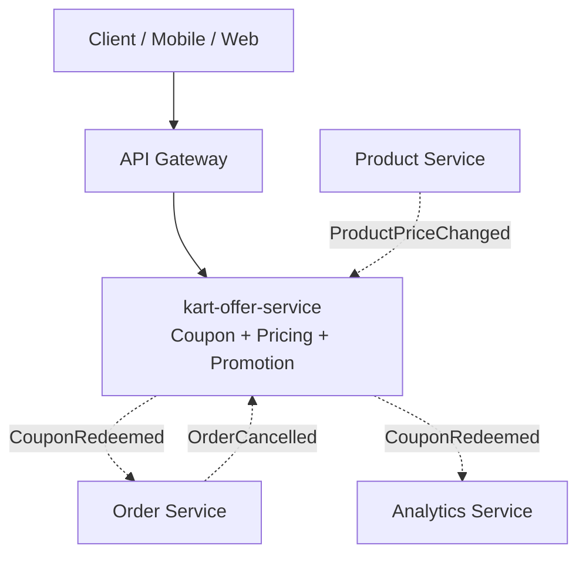

# Container Diagram (C4 Level 2)

Cumulative diagram, extended one service at a time as each passes through the Architecture Agent. See [service-boundaries.md](service-boundaries.md) for the tabular dependency detail behind each edge.

_Only `kart-offer-service` has been placed so far — this diagram grows as each subsequent service goes through the Architecture Agent._
