# Container Diagram (C4 Level 2)

Cumulative diagram, extended one service at a time as each passes through the Architecture Agent. See [service-boundaries.md](service-boundaries.md) for the tabular dependency detail behind each edge.

```mermaid
graph TB
    Client[Client / Mobile / Web]
    GW[API Gateway]
    Client --> GW

    GW --> Offer[kart-offer-service<br/>Coupon + Pricing + Promotion]
    GW --> Review[kart-review-service<br/>Review + Rating + Moderation]
    GW --> Cart[kart-cart-service<br/>Cart lifecycle + merge + expiry]
    GW --> Inventory[kart-inventory-service<br/>Stock + Reservations + Warehouses]
    GW --> Recommendation[kart-recommendation-service<br/>Personalization / recommendations]
    GW --> Admin[kart-admin-service<br/>Back-office RBAC + orchestration]
    GW --> DeliveryTracking[kart-delivery-tracking-service<br/>Carrier tracking + ETA]
    GW --> Category[kart-category-service<br/>Taxonomy + hierarchy + navigation]
    GW --> Wishlist[kart-wishlist-service<br/>Saved items + Price-Drop Alerts]
    Support[Support/Admin Console] --> GW
    GW -->|"sync REST: POST /payments/charge (secondary path — see below), POST /payments/{id}/refund (support-agent driven, BRD §22)"| Payment

    Product[Product Service] -. ProductPriceChanged .-> Offer
    Order[Order Service] -. OrderCancelled .-> Offer
    Offer -. CouponRedeemed .-> Order
    Offer -. CouponRedeemed .-> Analytics[kart-analytics-service<br/>Event ingestion + dashboards/funnels]
    Offer -. PriceQuoteIssued .-> Analytics
    Offer -. PromotionActivated .-> Analytics
    Offer -. PromotionDeactivated .-> Analytics
    Product -. ProductCreated .-> Analytics
    Product -. ProductPriceChanged .-> Analytics
    Product -. ProductUpdated .-> Analytics
    Product -. ProductPriceChanged .-> Wishlist
    Product -. ProductDiscontinued .-> Wishlist
    Wishlist -->|"sync, GET /products/{id}, hourly reconciliation job only — not on the /wishlist request path"| Product

    Order -. OrderDelivered .-> Recommendation
    Product -. ProductCreated .-> Recommendation
    ClickstreamSource[Clickstream event source<br/>publisher not yet named] -. "clickstream event(s), not yet named" .-> Recommendation
    Recommendation -->|"sync, GET /inventory/{sku}, fails open on timeout"| Inventory
    Recommendation -->|"sync, GET /products/{id}, fails open on timeout"| Product

    Order -. OrderDelivered .-> Review
    Review -. ReviewSubmitted .-> Product
    Review -. ReviewSubmitted .-> Analytics
    Review -. ReviewUpdated .-> Product
    Review -. ReviewUpdated .-> Analytics
    Classifier[Content-Safety Classifier<br/>external, non-platform] -. sync pre-check .-> Review

    Inventory -. InventoryReservationFailed .-> Cart
    Cart -. CartCheckedOut .-> Analytics
    Cart -->|gRPC, lazy validation, fails open| Product
    Cart -->|gRPC, lazy validation, fails open| Inventory

    Order -->|"POST /inventory/reserve, /release (sync)"| Inventory
    Order -. OrderCancelled .-> Inventory
    Order -. OrderCompensationTriggered .-> Inventory
    Inventory -. InventoryReserved .-> Order
    Inventory -. InventoryReservationFailed .-> Order
    Inventory -. InventoryReleased .-> Order
    Inventory -. InventoryReleased .-> Analytics
    Inventory -. InventoryReplenished .-> Analytics

    Payment[kart-payment-service<br/>Payment intents + Charge + Refund + Chargeback]
    PaymentGW[Payment Gateway<br/>external, tokenized card processing]
    Order -. OrderCreated .-> Payment
    Payment -->|"sync, tokenized charge/refund call, circuit breaker"| PaymentGW
    PaymentGW -.->|"async webhook, POST /payments/webhooks/{gateway}"| Payment
    Payment -. PaymentCompleted .-> Order
    Payment -. PaymentFailed .-> Order
    Payment -. RefundIssued .-> Order
    Payment -. ChargebackReceived .-> Order
    Payment -. "PaymentCompleted/Failed, RefundIssued, ChargebackReceived" .-> Analytics
    Shipping[kart-shipping-service<br/>Carrier Selection + Label Generation]
    Carriers[Shipping Carriers<br/>external, not a Kart service]
    Order -. OrderConfirmed .-> Shipping
    Shipping -. ShipmentDispatched .-> Order
    Shipping -. ShipmentDispatched .-> DeliveryTracking
    Shipping -. ShipmentDispatched .-> Analytics
    Shipping -. ShipmentCreationFailed .-> Order
    Shipping -. ShipmentCreationFailed .-> Analytics
    Shipping -->|"sync REST, rate/label generation, circuit breaker + secondary-carrier failover"| Carriers
    CarrierWebhook[Carrier webhook senders<br/>external, per-carrier, not a Kart service] -.->|"async, per-carrier HTTP push, HMAC-verified"| DeliveryTracking
    DeliveryTracking -->|"sync, per-carrier polling fallback, 6h staleness threshold, circuit breaker + bulkhead"| CarrierAPI[Carrier tracking APIs<br/>external, per-carrier, not a Kart service]
    DeliveryTracking -. "DeliveryStatusUpdated (terminal delivered status only)" .-> Order
    DeliveryTracking -. DeliveryStatusUpdated .-> Analytics
    Identity[kart-identity-service<br/>AuthN + Tokens + Sessions + MFA + RBAC + SSO]
    UserSvc[User Service]
    Notification[kart-notification-service<br/>Email/SMS/Push fan-out, consumer-only]
    EnterpriseIdP[Enterprise IdP<br/>Okta / Azure AD / Google Workspace, external]
    SocialIdP[Social IdP<br/>Google / Apple, external]

    GW -->|"sync REST: /auth/login, /auth/refresh, /auth/logout, /auth/mfa/verify, /auth/password/reset-initiate, /auth/password/reset-confirm"| Identity
    GW -->|"sync, cached JWKS public-key retrieval, not a per-request call"| Identity
    Identity -->|"sync, SAML AuthnRequest / OIDC authorization request, per-IdP bulkhead"| EnterpriseIdP
    EnterpriseIdP -.->|"sync, inline browser redirect: SAML ACS / OIDC callback"| Identity
    Identity -->|"sync, OIDC authorization request, own bulkhead group"| SocialIdP
    SocialIdP -.->|"sync, inline browser redirect: OIDC callback, resolves to Customer role only"| Identity
    Identity -. UserRegistered .-> UserSvc
    Identity -. UserRegistered .-> Analytics
    Identity -. SessionCreated .-> Analytics
    Identity -. UserAccountUpdated .-> UserSvc

    Category -. CategoryUpdated .-> Analytics

    InternalBI[Internal BI/ops/dashboard consumers<br/>not via public Gateway] -->|"sync, internal REST query API (/internal/v1/...) + BI-tool warehouse connection"| Analytics

    Admin -->|"sync REST, catalog management"| Product
    Admin -->|"sync REST, catalog management"| Category
    Admin -->|"sync REST, coupon issuance, POST /coupons"| Offer
    Admin -->|"sync REST, user suspension, lock/unlock"| Identity
    Admin -->|"sync REST, inventory replenishment"| Inventory
    Admin -. AdminActionPerformed .-> Analytics

    Order -. "OrderCreated/Confirmed/Cancelled/CompensationTriggered/Delivered" .-> Notification
    Payment -. "PaymentCompleted/Failed, RefundIssued, ChargebackReceived" .-> Notification
    Shipping -. ShipmentDispatched .-> Notification
    Shipping -. ShipmentCreationFailed .-> Notification
    DeliveryTracking -. DeliveryStatusUpdated .-> Notification
    Wishlist -. WishlistPriceAlertTriggered .-> Notification
    Wishlist -. WishlistPriceAlertTriggered .-> Analytics
    Identity -. UserRegistered .-> Notification
    UserSvc -. UserNotificationPreferenceUpdated .-> Notification
    UserSvc -. UserDataErased .-> Analytics
    UserSvc -. UserDataErased .-> Wishlist
    Notification -. NotificationSent .-> Analytics
```

_Placed so far: `kart-offer-service`, `kart-review-service`, `kart-cart-service`, `kart-notification-service`, `kart-inventory-service`, `kart-recommendation-service`, `kart-admin-service`, `kart-payment-service`, `kart-category-service`, `kart-shipping-service`, `kart-delivery-tracking-service`, `kart-product-service`, `kart-wishlist-service`, `kart-identity-service`, `kart-user-service`, `kart-search-service`, `kart-analytics-service` — this note was stale (missing the last six) until corrected during `kart-analytics-service`'s own Architecture Agent pass; this diagram grows as each subsequent service goes through the Architecture Agent. Only `kart-order-service` has not yet passed through this stage. `CarrierWebhook`/`CarrierAPI` are external, non-Kart systems (per-carrier third parties), not bounded contexts of this platform — shown only because they are Delivery Tracking's largest integration surface._
