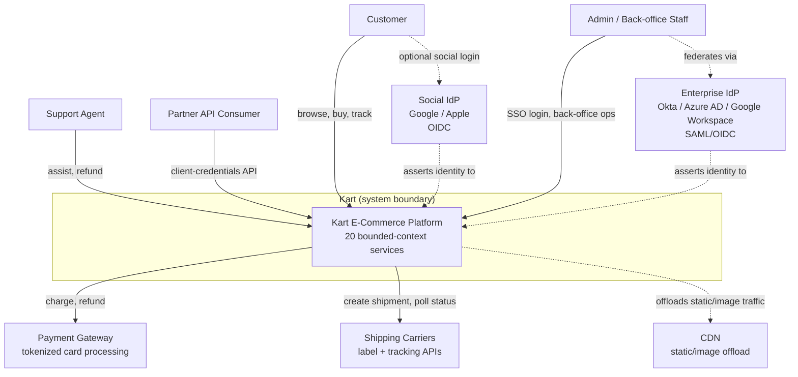

# System Context (C4 Level 1)

Kart as a single system box, its human actors, and the external systems it depends on. This is the level above [container-diagram.md](container-diagram.md) (C4 Level 2, which decomposes the box below into individual services) — see that file for the per-service breakdown and [service-boundaries.md](service-boundaries.md) for the tabular dependency detail.

## Actors

|Actor|Relationship to Kart|
|---|---|
|Customer|Browses catalog, manages cart/orders/wishlist; authenticates natively or via social SSO ([kart-requirements.md §24.2](../requirements/kart-requirements.md))|
|Support Agent|Assists customers within a capped RBAC grant ([kart-requirements.md §24.1](../requirements/kart-requirements.md))|
|Admin / Back-office Staff|Full back-office operations, authenticates via enterprise SSO federation|
|Partner API Consumer|Non-interactive, scoped client-credentials access (e.g., bulk catalog upload)|

## External Systems

|System|Why It's Outside the Boundary|
|---|---|
|Enterprise IdP|Owned by the org's IT, not Kart — Identity Service federates against it rather than reimplementing corporate auth|
|Social IdP|Third-party identity provider; Kart only ever sees the exchanged OIDC token, never the provider's user store|
|Payment Gateway|PCI scope reduction — card data is tokenized at the gateway, never stored inside Kart (BRD §5.3 Boundary Rationale)|
|Shipping Carriers|Physical fulfillment is executed by external carriers; Kart only requests labels and polls status|
|CDN|Static/image asset delivery is offloaded so origin traffic reflects only dynamic, business-logic requests (BRD §4.4)|

_Everything inside the "Kart" box is decomposed one level down in [container-diagram.md](container-diagram.md), which grows service-by-service as each passes through the Architecture Agent._
