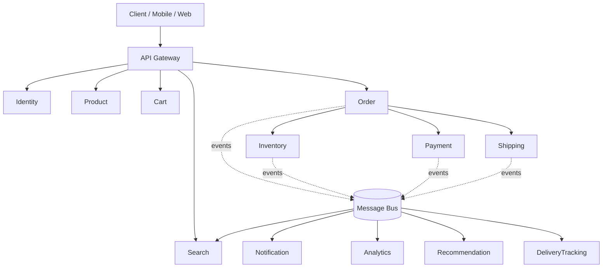
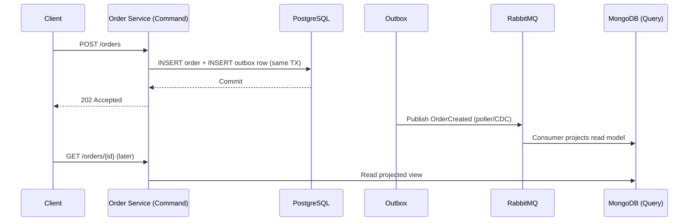
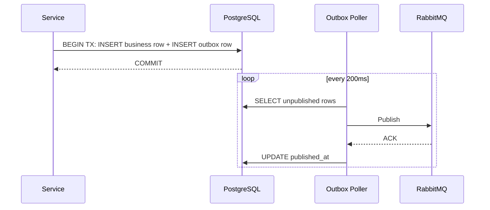
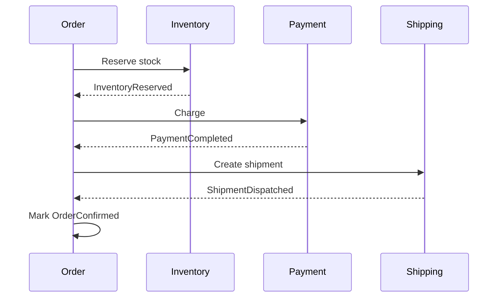
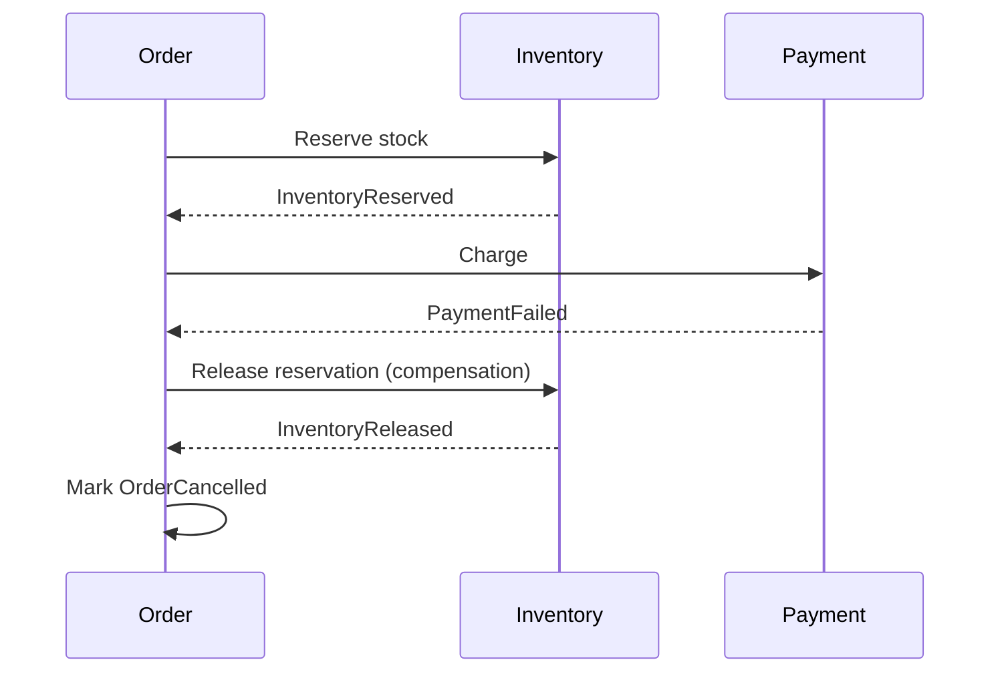
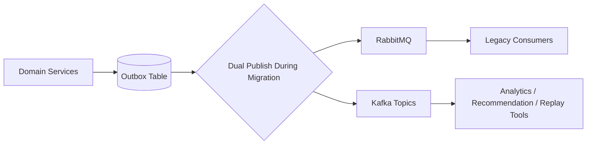

# Amazon-Scale E-Commerce Engineering Playground

### Senior Engineer System Design Mastery Project

**Stack:** .NET 9 / ASP.NET Core · PostgreSQL · MongoDB (Sharded) · RabbitMQ → Kafka · Redis · Docker · Kubernetes · Nginx · API Gateway

---

## 1. Executive Summary

### 1.1 Purpose

This is not an e-commerce build. It is a **deliberately over-engineered playground** that uses an e-commerce domain as the _carrier_ for a curriculum in distributed systems, data engineering, messaging, and operations. The e-commerce domain is chosen because it is the smallest domain that naturally forces every hard engineering problem to appear: money (consistency), inventory (contention), search (denormalization), notifications (fan-out), and scale (traffic spikes on sales days).

### 1.2 Why This Project Exists

Most tutorial e-commerce projects stop at CRUD + one database. That teaches almost nothing about what a Staff/Principal engineer actually does day to day: capacity planning, failure-mode design, choosing between consistency models, designing message infrastructure that survives partial outages, and defending architecture decisions in a design review. This project is structured so that **each section forces a decision**, and each decision has a documented trade-off, so it doubles as interview prep.

### 1.3 Learning Goals

|Domain|Concepts Covered|
|---|---|
|System Design|Service boundaries, CQRS, API Gateway, Load Balancing|
|Distributed Systems|Eventual consistency, Saga, idempotency, distributed tracing|
|Scalability|Sharding, partitioning, horizontal scaling, caching|
|Messaging|RabbitMQ topology, DLQ/DLX, Kafka migration, replay|
|Databases|PostgreSQL indexing/partitioning, MongoDB sharding, denormalization|
|DevOps|Docker multi-stage builds, Kubernetes, HPA, config/secrets|
|Reliability|Chaos engineering, failure simulation, retries, circuit breakers|
|Performance|Load testing at 100 RPM → 10M RPM, P95/P99 latency budgets|
|Security|JWT/OAuth2, API security, encryption at rest/in transit|
|Interviewing|100 system-design questions generated directly from this build|

### 1.4 What Makes This "Not Normal"

- Every service is **write-optimized in PostgreSQL, read-optimized in MongoDB**, connected by an Outbox → RabbitMQ → Kafka pipeline — on purpose, to teach CQRS synchronization pain.
- RabbitMQ is deliberately introduced first and later **broken on purpose** (replay requirements, huge throughput) to justify a real Kafka migration, rather than starting with Kafka because "it's cool."
- The messaging layer is **configuration-driven** (JSON-declared exchanges/queues/bindings), because in real orgs, message topology sprawl is a top-5 operational headache.
- Failure is a first-class feature: Section 13 and 26 exist specifically to break the system on purpose.

---

## 2. Business Requirements

### 2.1 Core Modules

|#|Service|Primary Responsibility|
|---|---|---|
|1|Identity Service|AuthN, tokens, sessions, MFA, SSO federation, RBAC role/claim issuance|
|2|User Service|Profile, addresses, preferences|
|3|Product Service|Product catalog, variants, attributes|
|4|Category Service|Taxonomy, hierarchy, navigation|
|5|Search Service|Full-text search, filters, facets, ranking|
|6|Inventory Service|Stock levels, reservations, warehouses|
|7|Cart Service|Cart lifecycle, merge, expiry|
|8|Order Service|Order lifecycle, order state machine|
|9|Payment Service|Payment intents, gateways, refunds|
|10–12|Offer Service (Coupon + Pricing + Promotion merge, see `kart-platform` ADR-0001)|Coupon issuance/redemption/limits; price computation, tax, currency; campaigns, flash sales, bundle deals — one bounded context, three aggregate roots (`Coupon`, `PricingQuote`, `PromotionCampaign`), not three separate day-one repos|
|13|Wishlist Service|Saved items, price-drop alerts|
|14|Review Service|Ratings, reviews, moderation|
|15|Notification Service|Email/SMS/push fan-out|
|16|Shipping Service|Carrier selection, label generation|
|17|Delivery Tracking Service|Real-time tracking, ETA|
|18|Recommendation Service|Personalization, "customers also bought"|
|19|Analytics Service|Event ingestion, dashboards, funnels|
|20|Admin Service|Back-office operations, RBAC|

**Note on service count**: this table names 20 BRD-level service *concerns*, but items 10–12 (Coupon/Pricing/Promotion) are merged into a single deployable repo, `kart-offer-service`, per ADR-0001 — so the platform ships **18 deployable service repos**, not 20. Item numbers 10–12 are retained as a single merged row (rather than renumbering 13–20) so existing citations to items 13–20 elsewhere in this document and in downstream design docs stay valid.

### 2.2 Domain Rules That Force Hard Engineering Decisions

- **Inventory** must never oversell → forces optimistic locking / reservation patterns.
- **Payment** must never double-charge → forces idempotency keys + Saga compensation.
- **Search** must reflect catalog changes within seconds, not milliseconds → forces eventual consistency conversation.
- **Order Service** is the Saga orchestrator touching Inventory, Payment, and Shipping → forces distributed transaction design.
- **Analytics** ingests every domain event → forces a durable event bus and schema versioning discipline.

---

## 3. Non-Functional Requirements

|Attribute|Target|Notes|
|---|---|---|
|Availability|99.99% (order path), 99.9% (secondary)|~52 min/year downtime budget for critical path|
|Scalability|Horizontal, stateless services|Autoscale via K8s HPA on CPU + queue depth|
|Reliability|No data loss on Order/Payment events|At-least-once delivery + idempotent consumers|
|Consistency|Strong (PostgreSQL/write path), Eventual (MongoDB/read path)|CQRS boundary explicit|
|Latency|P95 < 150ms, P99 < 400ms (read path)|P95 < 300ms (write path, includes Outbox insert)|
|Throughput|100K RPS sustained, 1M RPS burst (flash sale)|Read-heavy services scale independently of write|
|Fault Tolerance|Graceful degradation, no cascading failure|Circuit breakers on all outbound calls|
|Security|Zero plaintext secrets, signed tokens, TLS everywhere|JWT short-lived + refresh rotation|
|Maintainability|Independently deployable services|Contract-tested APIs, versioned events|
|Observability|100% trace coverage on order path|Correlation ID propagated end-to-end|

---

## 4. Capacity Planning

### 4.1 Business Assumptions

|Metric|Value|
|---|---|
|Registered Users|50,000,000|
|Daily Active Users|5,000,000|
|Average Orders/Day (normal)|1,000,000|
|Peak Orders/Day (flash sale, 20x)|20,000,000|
|Product Catalog Size|100,000,000 SKUs|
|Average Cart Size|3.2 items|
|Events per Order (created→delivered)|~14|

### 4.2 Traffic Derivation

|Load Tier|RPM|RPS|Scenario|
|---|---|---|---|
|Baseline|100|~2|Local dev / smoke test|
|Low|1,000|~17|Off-peak hours|
|Medium|100,000|~1,700|Normal daytime traffic|
|High|1,000,000|~17,000|Evening peak|
|Extreme|10,000,000|~167,000|Flash sale / Black Friday|

### 4.3 Storage & Message Volume

|Resource|Estimate|
|---|---|
|Product catalog storage (MongoDB, denormalized)|~2 TB|
|Order write storage (PostgreSQL, 5yr retention)|~4 TB|
|Daily event volume (all services)|~200M messages/day|
|Peak Kafka throughput|~50,000 messages/sec|
|Redis working set (hot products + sessions)|~64 GB|

### 4.4 Network

- Read:Write ratio ≈ 20:1 (typical catalog-heavy e-commerce).
- CDN offloads ~80% of product image/static traffic from origin.
- Inter-service east-west traffic budgeted separately from north-south (client-facing) traffic for K8s network policy planning.

---

## 5. Microservice Design

Each service below follows the same template: **Responsibility → API → Database → Events Published → Events Consumed → Dependencies → Boundary Rationale**.

### 5.1 Order Service (representative deep-dive — the Saga orchestrator)

|Aspect|Detail|
|---|---|
|Responsibility|Owns order lifecycle state machine: `Created → Reserved → Paid → Shipped → Delivered → Cancelled/Refunded`|
|API|`POST /orders`, `GET /orders/{id}`, `POST /orders/{id}/cancel`|
|Database|PostgreSQL: `orders`, `order_items`, `order_events` (write side)|
|Publishes|`OrderCreated`, `OrderConfirmed`, `OrderCancelled`, `OrderCompensationTriggered`, `OrderDelivered`|
|Consumes|`InventoryReserved`, `InventoryReservationFailed`, `PaymentCompleted`, `PaymentFailed`, `ShipmentDispatched`, `DeliveryStatusUpdated` (terminal "delivered" status, triggers `OrderDelivered` — see ADR-0005)|
|Dependencies|Inventory Service (sync reserve call + async confirm), Payment Service (async), Shipping Service (async)|
|Boundary Rationale|Order is the only service allowed to drive cross-service business transactions (Saga orchestrator) — this prevents "distributed monolith" behavior where every service calls every other service directly.|

### 5.2 Inventory Service

|Aspect|Detail|
|---|---|
|Responsibility|Stock truth per warehouse, reservation holds with TTL|
|API|`POST /inventory/reserve`, `POST /inventory/release`, `GET /inventory/{sku}`|
|Database|PostgreSQL with row-level `SELECT ... FOR UPDATE` on stock rows|
|Publishes|`InventoryReserved`, `InventoryReservationFailed`, `InventoryReplenished`, `InventoryReleased` (compensating release — named in §12.2's diagram, previously missing from this row and the Event Catalog; see ADR-0007)|
|Consumes|`OrderCancelled` (release), `OrderCompensationTriggered` (release)|
|Boundary Rationale|Isolated so oversell logic (the highest-contention code in the whole system) can be scaled, locked, and load-tested independently of everything else.|

### 5.3 Payment Service

|Aspect|Detail|
|---|---|
|Responsibility|Payment intents, idempotent charge execution, refunds|
|API|`POST /payments/charge` (requires `Idempotency-Key`), `POST /payments/{id}/refund`|
|Database|PostgreSQL: `payment_intents`, `idempotency_keys` (unique constraint)|
|Publishes|`PaymentCompleted`, `PaymentFailed`, `RefundIssued`|
|Consumes|`OrderCreated` (initiate charge)|
|Boundary Rationale|Isolated for PCI-scope reduction — only this service touches gateway tokens; blast radius of a compromise is contained.|

### 5.4 Remaining Services (condensed)

|Service|API surface|DB|Key Events Published|Key Events Consumed|
|---|---|---|---|---|
|Identity|`/auth/login`, `/auth/refresh`|PostgreSQL|`UserRegistered`, `SessionCreated`, `UserAccountUpdated` (email/name change — see ADR-0006)|—|
|User|`/users/{id}`|PostgreSQL → MongoDB read|`UserProfileUpdated`|`UserRegistered`, `UserAccountUpdated` (see ADR-0006)|
|Product|`/products/{id}`|PostgreSQL → MongoDB read|`ProductCreated`, `ProductPriceChanged`|—|
|Category|`/categories`|PostgreSQL|`CategoryUpdated`|—|
|Search|`/search` (query only)|MongoDB / OpenSearch|—|`ProductCreated`, `ProductPriceChanged`|
|Cart|`/cart`, `/cart/merge`|Redis + PostgreSQL snapshot|`CartCheckedOut`|`InventoryReservationFailed`|
|Offer (Coupon+Pricing+Promotion merge, see `kart-platform` ADR-0001)|`/coupons/validate`, `/pricing/quote`, `/promotions/active`|PostgreSQL (+ Redis cache for Promotion's active-campaign reads)|`CouponRedeemed`, `PriceQuoteIssued`, `PromotionActivated`|`ProductPriceChanged` (Pricing sub-context reacts to catalog price moves when computing quotes — Product is the publisher, see §10), `OrderCancelled` (Coupon sub-context, releases a redemption hold)|
|Wishlist|`/wishlist`|MongoDB|`WishlistPriceAlertTriggered`|`ProductPriceChanged`|
|Review|`/reviews`|PostgreSQL → MongoDB read|`ReviewSubmitted`|`OrderDelivered` (canonical name — see ADR-0005)|
|Notification|(consumer only, no public API)|PostgreSQL (audit)|`NotificationSent`|All `order.*` and `payment.*` routed events (per §9's manifest), plus `WishlistPriceAlertTriggered`, `UserRegistered`, `OrderDelivered` — resolved scope, see ADR-0003; §10 lists the full resolved consumer set per event|
|Shipping|`/shipments`|PostgreSQL|`ShipmentDispatched`|`OrderConfirmed`|
|Delivery Tracking|`/tracking/{id}`|MongoDB|`DeliveryStatusUpdated`|carrier webhook → internal event|
|Recommendation|`/recommendations/{userId}`|MongoDB|—|`OrderDelivered` (see ADR-0005 — supersedes the BRD's earlier "OrderCompleted" naming), clickstream events|
|Analytics|(ingestion only)|Kafka topics → warehouse|—|All events, full fan-in — resolved scope, see ADR-0004; §10 lists Analytics as a consumer on every row|
|Admin|`/admin/*` (RBAC-gated)|PostgreSQL|`AdminActionPerformed`|—|

### 5.5 Service Boundary Diagram



---

## 6. Database Design

### 6.1 PostgreSQL (Write Side)

**Example — `orders` table**

```sql
CREATE TABLE orders (
    order_id       UUID PRIMARY KEY,
    user_id        UUID NOT NULL,
    status         VARCHAR(20) NOT NULL,
    total_amount   NUMERIC(12,2) NOT NULL,
    created_at     TIMESTAMPTZ NOT NULL DEFAULT now()
) PARTITION BY RANGE (created_at);

CREATE TABLE orders_2026_07 PARTITION OF orders
    FOR VALUES FROM ('2026-07-01') TO ('2026-08-01');

CREATE INDEX idx_orders_user_id ON orders (user_id);
CREATE INDEX idx_orders_status_created ON orders (status, created_at DESC);
```

|Technique|Where Used|Why|
|---|---|---|
|Range Partitioning by month|`orders`, `order_events`|Bounded index size, fast archival of old partitions|
|B-Tree composite index|`(status, created_at)`|Supports "all pending orders in last hour" dashboards|
|`SELECT ... FOR UPDATE`|Inventory stock rows|Prevents oversell under concurrent reservation|
|Unique constraint on idempotency key|Payment|Guarantees exactly-once charge attempt semantics|

Every mutable table shown throughout this document (and every table any service adds going forward) also carries the standard `created_at`/`updated_at`/`created_by`/`updated_by` audit columns defined in §24.3 — omitted from the example above only for brevity, not because `orders` is exempt.

**Read-Heavy vs Write-Heavy**

|Service|Profile|Reasoning|
|---|---|---|
|Order, Payment, Inventory|Write-heavy|Correctness > raw read speed → PostgreSQL is source of truth|
|Product, Search, Category|Read-heavy|Millions of reads per write → MongoDB/denormalized is source of truth for reads|

### 6.2 MongoDB (Read Side, Sharded)

**Example — denormalized `product_read_model` collection**

```json
{
  "_id": "sku-192837",
  "name": "Wireless Mouse",
  "category": { "id": "cat-12", "name": "Electronics" },
  "price": { "amount": 24.99, "currency": "USD" },
  "inventoryStatus": "IN_STOCK",
  "ratingSummary": { "avg": 4.6, "count": 1899 },
  "searchTokens": ["wireless", "mouse", "electronics"]
}
```

|Aspect|Design|
|---|---|
|Sharding Key|`category.id` for Product/Search collections (even distribution + locality for browse queries)|
|Replica Sets|3-node replica set per shard, majority write concern for read-model durability|
|Denormalization|Category name, price, and rating summary embedded directly to avoid joins on the read path|
|Why Denormalize|MongoDB has no cross-shard joins; embedding trades storage/staleness for read latency|

---

## 7. CQRS Design



- **Command Side**: PostgreSQL, strongly consistent, transactional writes.
- **Query Side**: MongoDB, eventually consistent, optimized for the exact shape the UI needs.
- **Eventual Consistency Window**: typically sub-second, but must be surfaced to the client (e.g., "processing your order" state) rather than hidden.
- **Failure Handling**: if the projection consumer fails, the Outbox row remains unacknowledged/retried — the read model is _always_ rebuildable from the write side, which is the core CQRS safety property.

---

## 8. RabbitMQ Design

### 8.1 Topology

|Element|Design|
|---|---|
|Exchange type|Topic exchange (`ecommerce.events`) for flexible routing by `service.entity.action` keys|
|Routing Key Convention|`order.created`, `payment.completed`, `inventory.reservation.failed`|
|Queue per Consumer Group|Each service owns its own queue bound with a wildcard pattern, e.g. `notification.*`|
|DLX|Every queue has `x-dead-letter-exchange` pointing to a shared `dlx.ecommerce`|
|DLQ|One DLQ per service queue, inspected via admin tooling, never silently dropped|
|Retry Queue|TTL-based "parking lot" queue (`retry.5s`, `retry.30s`, `retry.5m`) that dead-letters back into the original queue after expiry — classic RabbitMQ delayed-retry pattern|

### 8.2 Why This Design

- **Topic exchange over direct exchange**: allows adding new consumers without touching the publisher — publishers don't know or care who's listening.
- **Per-service DLQ over one global DLQ**: failure triage is per-team; a global DLQ becomes an unowned dumping ground.
- **TTL-ladder retry over immediate requeue**: immediate requeue under a persistent failure (e.g., DB down) creates a hot retry loop that pins CPU; a backoff ladder spaces retries out.

### 8.3 Alternatives Considered

|Alternative|Pros|Cons|
|---|---|---|
|Direct exchange per event type|Simpler routing|Explodes exchange count, hard to add cross-cutting consumers|
|Single shared queue for all consumers|Fewer resources|One slow consumer blocks all others (no isolation)|
|Kafka from day one|Replay, higher throughput|Overkill for early-stage bounded queues; steeper ops learning curve early|

---

## 9. Configuration-Driven Message Bus

Application startup reads a JSON manifest and declares all RabbitMQ topology idempotently (`durable`, declare-if-not-exists) — no manual `rabbitmqctl` setup, no drift between environments.

```json
{
  "exchanges": [
    { "name": "ecommerce.events", "type": "topic", "durable": true }
  ],
  "queues": [
    {
      "name": "notification.queue",
      "bindings": [
        { "exchange": "ecommerce.events", "routingKey": "order.*" },
        { "exchange": "ecommerce.events", "routingKey": "payment.*" }
      ],
      "arguments": {
        "x-dead-letter-exchange": "dlx.ecommerce",
        "x-dead-letter-routing-key": "notification.dlq"
      }
    },
    {
      "name": "notification.dlq",
      "bindings": [
        { "exchange": "dlx.ecommerce", "routingKey": "notification.dlq" }
      ]
    },
    {
      "name": "retry.30s",
      "arguments": {
        "x-message-ttl": 30000,
        "x-dead-letter-exchange": "ecommerce.events",
        "x-dead-letter-routing-key": "notification.retry"
      }
    }
  ]
}
```

**Why config-driven beats code-driven**: topology changes become a reviewable diff instead of a code deploy; the same manifest can be diffed across dev/staging/prod to catch drift; non-backend engineers (SRE, on-call) can read the JSON to understand routing without reading C#.

---

## 10. Event Catalog

|Event|Publisher|Consumer(s)|Payload (key fields)|Retry|DLQ Strategy|
|---|---|---|---|---|---|
|`OrderCreated`|Order|Payment, Analytics, Notification|orderId, userId, items, total|3x exponential|to `order.dlq`, manual replay tool|
|`OrderConfirmed`|Order|Shipping, Notification, Analytics|orderId, address|3x|`order.dlq`|
|`OrderCancelled`|Order|Inventory, Coupon, Notification, Analytics|orderId, reason|3x|`order.dlq`|
|`OrderCompensationTriggered`|Order|Inventory, Notification, Analytics|orderId, reason|3x|`order.dlq`|
|`OrderDelivered`|Order|Recommendation, Review, Notification, Analytics|orderId, deliveredAt|3x|`order.dlq`|
|`InventoryReserved`|Inventory|Order, Analytics|orderId, sku, qty|2x|`inventory.dlq`|
|`InventoryReservationFailed`|Inventory|Order, Cart, Analytics|orderId, sku|2x|`inventory.dlq`|
|`InventoryReleased`|Inventory|Order, Analytics|orderId, sku, qty|2x|`inventory.dlq`|
|`InventoryReplenished`|Inventory|Analytics|sku, qtyAdded, warehouseId|2x|`inventory.dlq`|
|`PaymentCompleted`|Payment|Order, Analytics, Notification|orderId, txnId|5x (money-critical)|`payment.dlq`, paged on-call|
|`PaymentFailed`|Payment|Order, Notification, Analytics|orderId, reason|5x|`payment.dlq`, paged on-call|
|`RefundIssued`|Payment|Order, Notification, Analytics|orderId, refundId, amount|5x (money-critical)|`payment.dlq`, paged on-call|
|`ShipmentDispatched`|Shipping|Order, Notification, Tracking, Analytics|orderId, carrier, trackingId|3x|`shipping.dlq`|
|`DeliveryStatusUpdated`|Delivery Tracking|Order (terminal status only), Notification, Analytics|trackingId, status|3x|`tracking.dlq`|
|`ProductCreated`|Product|Search, Recommendation, Analytics|sku, attributes|3x|`catalog.dlq`|
|`ProductPriceChanged`|Product|Search, Wishlist, Offer, Analytics|sku, oldPrice, newPrice|3x|`catalog.dlq`|
|`ReviewSubmitted`|Review|Product (rating recalc), Analytics|orderId, sku, rating|2x|`review.dlq`|
|`CategoryUpdated`|Category|Analytics|categoryId, name|3x|`catalog.dlq`|
|`CouponRedeemed`|Offer|Order, Analytics|code, orderId|2x|`coupon.dlq`|
|`PriceQuoteIssued`|Offer|Analytics|quoteId, sku, finalPrice|2x|`coupon.dlq`|
|`PromotionActivated`|Offer|Analytics|campaignId, sku, discount|2x|`coupon.dlq`|
|`UserProfileUpdated`|User|Analytics|userId, changedFields|2x|`user.dlq`|
|`NotificationSent`|Notification|Analytics|userId, channel, status|1x (fire-and-forget audit)|`notification.dlq`|
|`CartCheckedOut`|Cart|Analytics (funnel/conversion tracking)|cartId, userId, items|2x|`cart.dlq`|
|`WishlistPriceAlertTriggered`|Wishlist|Notification, Analytics|userId, sku, oldPrice, newPrice|2x|`wishlist.dlq`|
|`AdminActionPerformed`|Admin|Analytics (audit trail)|adminId, action, entityId|1x (fire-and-forget audit)|`admin.dlq`|
|`UserRegistered`|Identity|User, Notification, Analytics|userId, email|3x|`identity.dlq`|
|`SessionCreated`|Identity|Analytics|userId, sessionId|2x|`identity.dlq`|
|`UserAccountUpdated`|Identity|User, Analytics|userId, email, displayName|2x|`identity.dlq`|

_Money-moving events (`Payment*`, `RefundIssued`) get the highest retry budget and human paging; catalog/search events get looser retry because staleness is tolerable for seconds. This table was extended to close two categories of gap found during platform review (see `kart-platform/docs/adr/0002-*.md` through `0007-*.md`): (1) events named in a service's own row (§5.4) that had no Event Catalog entry at all — `OrderCompensationTriggered`, `InventoryReleased`, `InventoryReplenished`, `RefundIssued`, `CartCheckedOut`, `WishlistPriceAlertTriggered`, `AdminActionPerformed`, `UserRegistered`, `SessionCreated` — and (2) two genuinely ambiguous consumer-scope questions (Notification's actual consumed-event set, Analytics' actual ingestion scope) that were resolved rather than left to each service to guess independently. `OrderDelivered` and `UserAccountUpdated` are new events, not previously named anywhere in the BRD — see ADR-0005 and ADR-0006 respectively for why they were needed.

A second review pass (see `kart-platform/docs/adr/0008-*.md`) found this table still incomplete after ADR-0007: four more events named as a service's own Publish in §5.4 had no row at all — `CategoryUpdated`, `PriceQuoteIssued`, `PromotionActivated`, `UserProfileUpdated` — now added above with Analytics as the only consumer per ADR-0004's stated default ("every future new event automatically has Analytics as a consumer"); whether any other service also needs to consume them is not resolved here and is not assumed. The same pass found `UserAccountUpdated`'s row violated that same ADR-0004 default (Analytics was missing) — fixed above. It also found `ProductPriceChanged`'s Publisher was still listed as "Pricing" here even though §5.4's Product row states Product publishes it and ADR-0001 explicitly left this contradiction open pending `kart-offer-service`'s own resolution (Product publishes; Pricing/Offer only consumes) — that resolution is now applied directly here, with Offer added to the consumer list since §5.4's Offer row states it consumes this event. `ProductUpdated` (named only in §16's caching prose, never in Product's own Publishes list at §5.4) remains a deliberately unresolved ambiguity — see `kart-platform/docs/services/kart-product-service/requirement-spec.md` Open Question #6 — not silently added as a new catalog row here._

---

## 11. Outbox Pattern

**Problem**: writing to PostgreSQL and publishing to RabbitMQ are two separate systems — a crash between them either loses the event or double-processes it ("dual write problem").

**Solution**: write the event into an `outbox` table in the _same database transaction_ as the business write. A separate poller/CDC process reads unpublished outbox rows and publishes them, marking them published only after broker ack.

```sql
CREATE TABLE outbox (
    id            UUID PRIMARY KEY,
    aggregate_id  UUID NOT NULL,
    event_type    VARCHAR(100) NOT NULL,
    payload       JSONB NOT NULL,
    created_at    TIMESTAMPTZ NOT NULL DEFAULT now(),
    published_at  TIMESTAMPTZ NULL
);
CREATE INDEX idx_outbox_unpublished ON outbox (created_at) WHERE published_at IS NULL;
```

**Retry**: poller re-reads rows where `published_at IS NULL` older than a threshold; publish is idempotent on the consumer side via event `id` deduplication.



---

## 12. Saga Pattern

### 12.1 Order Saga — Success Flow



_Integration style note (resolves the apparent sync-call reading of this diagram for the Payment→Shipping portion — see ADR-0002 in `kart-platform`; the Inventory step is excluded from this note, see below): from the `Order->>Payment: Charge` arrow onward, every arrow is async pub/sub over the message bus, not synchronous RPC — the same request/reply notation is used for the Payment step, and Payment is unambiguously stated as async in §5.1's Dependencies row, so the notation itself carries no sync/async meaning for those steps, only causal order. `OrderConfirmed` is published as soon as Payment clears (before Shipping has actually created anything) — Shipping is an async consumer of `OrderConfirmed`, exactly as §5.4/§10 state — and `ShipmentDispatched` flows back to Order purely as an informational status update. "Order->>Order: Mark OrderConfirmed" as the last line is diagram shorthand for "the happy path completed end-to-end," not a literal publish-order requirement that confirmation waits on shipment creation.
`Order->>Inventory: Reserve stock` / `Inventory-->>Order: InventoryReserved` (the first two arrows) are the one exception this note does **not** cover: §5.1's Dependencies row states this call is synchronous ("sync reserve call + async confirm") and §5.2 gives it a REST API shape (`POST /inventory/reserve`), consistent with the diagram's literal reading — a genuinely synchronous RPC, not async pub/sub, with `InventoryReserved` published afterward for the async saga-advancement side of that same step (see `kart-platform` ADR-0009, which narrows ADR-0002's original note — ADR-0002 was scoped to Order↔Shipping only, but this note's prior wording ("every arrow above") had overreached to imply the Inventory step too, contradicting §5.1/§5.2)._

### 12.2 Order Saga — Failure & Compensation Flow



**Payment Saga**: charge → (on later dispute) refund is itself a compensating action, tracked as its own saga instance rather than reusing the order saga state machine, since refunds can be partial and asynchronous relative to the original order lifecycle.

---

## 13. Failure Simulation

|Scenario|Injection Method|Detection|Recovery|
|---|---|---|---|
|Service Down|Kill pod / scale to 0|K8s liveness probe fails, alert fires|K8s restarts pod; upstream circuit breaker opens meanwhile|
|Database Down|Block PG port via network policy|Connection pool exhaustion metric spikes|Failover to replica; writes queue in Outbox until DB returns|
|RabbitMQ Down|Stop broker container|Publisher confirms time out|Local durable buffer / retry with backoff; alert on-call|
|Consumer Failure|Throw exception in handler|Unacked message count grows|Message redelivered after visibility timeout; after N attempts → DLQ|
|Network Partition|`tc netem` packet loss|Elevated P99 latency, timeout errors|Circuit breaker trips, fallback to cached/degraded response|
|Duplicate Message|Force redelivery twice|Downstream state mismatch if not idempotent|Idempotency key check at consumer — second delivery is a no-op|
|Slow Database|Inject artificial query delay|Query duration histogram P99 spikes|Connection pool timeout + bulkhead isolates slow path from others|
|Queue Overflow|Flood publisher faster than consumers drain|Queue depth metric breaches threshold alert|Autoscale consumers via K8s HPA on queue-depth custom metric|

---

## 14. RabbitMQ Limitations

RabbitMQ is a smart broker with dumb consumers — great for task distribution, weak for the following:

|Limitation Encountered|Why It Hurts Here|
|---|---|
|No native replay|Analytics needs to reprocess 30 days of `OrderCreated` after a bug fix — RabbitMQ queues are consumed and gone|
|Throughput ceiling under heavy fan-out|Flash-sale traffic (167K RPS) with 10+ consumer groups per event multiplies effective message rate beyond comfortable single-node broker throughput|
|No log-based partitioned parallelism|Kafka partitions allow ordered, parallel consumption per key (e.g., per `orderId`); RabbitMQ queues don't give the same partition-level parallel ordering guarantee at scale|
|Retention is a queue, not a log|Once consumed & acked, the message is gone — no "time travel" for new consumers added later|

---

## 15. Kafka Migration



**Why**: Analytics and Recommendation need replay and high-throughput partitioned consumption; Notification and transactional Order/Payment flows stay on RabbitMQ because they need low-latency task-queue semantics (ack/nack, per-message routing), not a log.

**Migration Strategy**: strangler pattern — dual-publish from the Outbox to both brokers during a transition window, migrate consumers one at a time (analytics first, since it's the one hitting RabbitMQ's replay limitation), then retire the RabbitMQ topic once every consumer group has cut over. Order/Payment/Inventory remain on RabbitMQ permanently — this is a case-by-case migration, not a wholesale replacement.

---

## 16. Caching

|Pattern|Where Used|Detail|
|---|---|---|
|Cache-Aside|Product detail reads|App checks Redis first; on miss, reads MongoDB and populates cache with TTL|
|Write-Through|Promotion/active-campaign flags|Write updates Redis and DB synchronously since staleness there is unacceptable for pricing|
|Distributed Cache|Session tokens, cart snapshots|Redis Cluster, consistent hashing across nodes|

**Cache Invalidation**: TTL + explicit invalidation on `ProductPriceChanged`/`ProductUpdated` events (cache-busting via event consumer, not just TTL expiry) to avoid serving stale prices.

**Hot Keys**: flash-sale SKUs can concentrate reads on one Redis key/shard; mitigated with local in-process micro-cache (few hundred ms) in front of Redis plus key sharding (`sku:{id}:{shard}`) for extreme cases.

---

## 17. Search

- **Engine**: OpenSearch (Elasticsearch-compatible), fed by the same Outbox/event pipeline as MongoDB read models — search index and MongoDB read model are siblings, not dependent on each other.
- **Product Search**: multi-match query across name/description/brand fields with boosting on exact SKU/brand match.
- **Ranking**: relevance score blended with business signals — rating, in-stock status, and a controlled "sponsored placement" boost.
- **Filtering**: faceted aggregations on category, price range, and rating, computed server-side to avoid over-fetching.

---

## 18. API Gateway

|Concern|Design|
|---|---|
|Routing|Path-based routing to services (`/orders/*` → Order Service) with version prefix (`/v1/`)|
|Authentication|JWT validated at gateway edge; downstream services trust a signed internal header, not the raw client token|
|Rate Limiting|Token-bucket per API key/user, tiered limits (anonymous < authenticated < partner API)|

---

## 19. Reverse Proxy

Nginx sits in front of the gateway for TLS termination, static asset serving, and request buffering. A **proxy** forwards client requests to a specific known backend on behalf of the client; a **reverse proxy** sits in front of a server farm and decides which backend serves a request, hiding backend topology from the client — Nginx here fulfils the latter role.

---

## 20. Load Balancing

|Algorithm|Used For|Reasoning|
|---|---|---|
|Round Robin|Stateless read services (Product, Search)|Even distribution, no session affinity needed|
|Least Connections|Order/Payment write path|Avoids piling long-running write requests onto an already-busy pod|

---

## 21. Containerization

- **Multi-stage Dockerfile**: SDK image builds/publishes .NET binaries in stage 1; final image copies only the published output onto a minimal ASP.NET runtime base — keeps production images small and reduces attack surface.
- **Layer Caching**: `COPY *.csproj` + `dotnet restore` as an early layer, separate from `COPY . .` + build, so dependency restore is cached across builds when only source code changes.

---

## 22. Kubernetes

|Object|Role in This Project|
|---|---|
|Pod|Smallest deployable unit — one service instance|
|Deployment|Manages replica count + rolling updates per service|
|Service|Stable internal DNS + load balancing across pods|
|Ingress|External HTTP routing into the cluster (fronted by the API Gateway)|
|HPA|Autoscales consumer pods on custom metric: RabbitMQ/Kafka queue depth, not just CPU|
|ConfigMap|Non-secret config (message bus topology JSON, feature flags)|
|Secret|DB credentials, JWT signing keys, payment gateway API keys|

---

## 23. Observability

|Pillar|Implementation|
|---|---|
|Structured Logging|JSON logs with `traceId`, `service`, `level`, `orderId` fields — machine-parseable, not free text|
|Metrics|RED metrics (Rate, Errors, Duration) per service + business metrics (orders/min, cart abandonment)|
|Distributed Tracing|W3C Trace Context propagated through HTTP headers and message headers so a single order can be traced across all 8+ services it touches|

**Normal Logging vs Structured Logging**: normal logging writes free-text strings meant for a human reading a terminal (`"Order 123 failed"`); structured logging writes key-value/JSON records meant for a machine to index, filter, and aggregate (`{"event":"order_failed","orderId":"123","reason":"payment_declined"}`) — the latter is what makes "show me all failed orders for user X in the last hour" a query instead of a `grep` archaeology project.

---

## 24. Security

|Layer|Control|
|---|---|
|AuthN|OAuth2 Authorization Code flow (web/mobile clients), Client Credentials (service-to-service), SSO via OIDC/SAML federation (see §24.2)|
|AuthZ|JWT with scoped claims, validated at gateway + re-checked at service for sensitive operations; RBAC role claims embedded in the token, enforced platform-wide (see §24.1)|
|Token Lifecycle|Short-lived access tokens (~15 min), rotating refresh tokens, revocation list for logout|
|Encryption|TLS 1.3 in transit everywhere; AES-256 at rest for PII columns; payment data never stored — tokenized by the gateway provider|
|API Security|Input validation, rate limiting, mandatory idempotency keys on all money-moving POSTs|

### 24.1 Cross-Cutting RBAC Model

RBAC on this platform is deliberately **two-tier**, and the split is the load-bearing decision of this section: **who you are** (identity + coarse role) is a platform-wide concern with exactly one issuer, but **what you may actually do to a given piece of data** (read it, write it, delete it) is a resource-owning-service concern, because only the service that owns an aggregate understands the domain rules that gate its mutation. Conflating the two — e.g., trying to express "Support Agent can refund up to $X" as a claim Identity Service issues — would force Identity to encode every downstream service's business rules into a token, which is both infeasible (Identity cannot know an order's total at token-mint time) and a layering violation (it would make Identity a second source of truth for domain logic that belongs to Payment, Order, Admin, etc.). The two tiers:

|Tier|Owned By|Answers|Changes How Often|
|---|---|---|---|
|Coarse Role|Identity Service (single issuer, platform-wide)|"Is this principal a Customer, Support Agent, Admin, or Partner API?"|Rarely — a small, stable, platform-wide vocabulary|
|Fine-Grained Permission (CanRead / CanWrite / CanDelete)|Each individual resource-owning service|"Given that coarse role, may this principal read/write/delete *this specific resource*?"|Per-service, as often as that service's own domain rules evolve|

#### 24.1.1 Coarse Role Catalog (Centrally Issued)

|Role|Scope|Example Grant|
|---|---|---|
|Customer|Own resources only (`userId` match)|Manage own cart, orders, wishlist|
|Support Agent|Read + limited write across customer-facing services|View any order, issue a refund up to a capped amount|
|Admin|Full back-office operations|Catalog management, coupon issuance, user suspension — all `/admin/*` routes|
|Partner API|Scoped, non-interactive|Bulk catalog upload, order status webhook — client-credentials flow only|

- **Issuance**: Identity Service resolves a user/service-principal to a role set at token-mint time and embeds it as a scoped claim in the JWT (`roles: [...]`, `scopes: [...]`) — this is the same JWT already described in §24 AuthZ, not a separate token.
- **Why one issuer for this tier only**: with 18 independently-deployed services, a locally-defined *coarse role* table per service silently drifts (Admin's "Support" role and Order's "Support" role diverge in meaning within a year). One issuer + one claim shape is what makes the coarse role auditable across the whole platform. This reasoning applies only to the coarse role vocabulary above — it is not an argument for centralizing the fine-grained permission decision in §24.1.2, which is a different kind of concern (domain business logic, not identity).

#### 24.1.2 Fine-Grained Permission Ownership — CanRead / CanWrite / CanDelete (Service-Owned)

**Principle: every service is the sole authority for CanRead, CanWrite, and CanDelete decisions over the resources it owns.** No central "permission service" or shared permission table decides whether a given coarse role may read, write, or delete a specific Order, Payment, Coupon, or Review — that decision is made, versioned, and enforced by the service that owns the aggregate, using whatever mechanism fits its own domain. This mirrors the DDD bounded-context ownership rule already established elsewhere in this document (e.g. Admin's Domain Invariant #3, "never becomes a second owner of another service's domain data") — permission logic over a resource is itself part of that resource's domain, and belongs to the same owner.

- **Why per-service, not central**: the 18 services differ sharply in how complex their access rules are, and a single shared model cannot fit all of them without either over-simplifying the strict cases or over-engineering the simple ones:
  - **Attribute/data-dependent rules**: Payment Service's "Support Agent may issue a refund, but only up to $X" depends on the order's own total — data only Payment holds. No claim issued at token-mint time can encode this.
  - **State-machine-gated rules**: whether an Order can be written to (cancelled, amended) depends on its current state-machine position (§12 Saga) — a rule only Order Service's own state machine can evaluate.
  - **Persisted, revocable grants**: Admin Service's back-office actions are gated by a durable, per-category grant record (`admin_permission_grants`, keyed on `principal_id` + category, with a `granted_by`/revoked-at audit trail) because back-office grants are infrequent, individually auditable, and must survive independently of any single request — a shape Payment's inline $-cap rule does not need and should not be forced into.
  - **Simple ownership-only rules**: Cart, Wishlist, and User services need nothing more than "does `resource.userId == token.sub`" — introducing a persisted grant table here would be pure overhead for a rule that is a one-line comparison.
- **What this looks like per service** (representative, not exhaustive):

|Service|Resource It Owns|CanRead / CanWrite / CanDelete Rule (service-decided)|Mechanism Chosen|
|---|---|---|---|
|Order Service|Order aggregate|CanWrite gated by current order state (e.g. no write once `Delivered`/`Cancelled`); CanDelete never exposed — orders are voided via state transition, never hard-deleted|Inline state-machine guard clause|
|Payment Service|PaymentIntent, Refund|CanWrite (refund) gated by a Support Agent's capped amount, computed against the order's own total at request time|Inline business rule, evaluated per-request|
|Admin Service|admin_permission_grants, admin_actions|CanWrite on any `/admin/*` category gated by a live, non-revoked grant row for `(principal_id, category)`|Persisted grant table, uncached indexed point-lookup|
|Review Service|Review aggregate|CanWrite (edit) gated by moderation status and an author-only edit window; CanDelete available to the author pre-moderation, to Admin post-moderation|Inline rule combining ownership + status|
|Cart / Wishlist / User Service|Cart, Wishlist, Address/Profile|CanRead/CanWrite/CanDelete gated purely by resource ownership (`userId` match)|Ownership comparison, no persisted grant needed|

- **Platform does not mandate one mechanism**: a persisted grant table, an inline rule, or a plain ownership check are all valid implementations of this tier — the requirement is that the *decision* is owned by the resource's service, not that every service must build the same kind of permission store. Each service's own `requirement-spec.md`/`ddd-model.md`/`design-decisions.md` records which mechanism it chose and why, the same way `kart-admin-service/design-decisions.md` already documents its grant-table choice.
- **Auditability at this tier**: because the mechanism varies per service, the audit obligation is per-service too — any service whose fine-grained permission decision denies or grants a sensitive action (refund, suspension, deletion) must be able to answer "who was allowed to do this, and why" from its own data, the same standard Admin's `admin_actions`/`granted_by` columns already meet. A service introducing a new CanWrite/CanDelete rule records the actor who satisfied it, not just that the check passed.

#### 24.1.3 Enforcement Flow (Three Checks, Not Two)

1. **API Gateway (§18)** — coarse-grained: rejects a request outright if the JWT lacks the coarse role a route requires (e.g. no `Admin` role claim → `/admin/*` never reaches Admin Service).
2. **Owning service** — fine-grained: the request that does reach the service is evaluated against that service's own CanRead/CanWrite/CanDelete decision (§24.1.2) — the gateway cannot make this call because it does not have (and must not be given) the domain data the decision depends on.
3. **Database (§24.1.4)** — row-level, as the last line of defense: even if a service's application code contains a bug that fails to filter a query correctly, the database itself refuses to return or mutate rows the caller does not own.

#### 24.1.4 Row-Level Security — Decided by Data Ownership, Enforced at the Database Layer

Row-level security follows the same ownership principle as §24.1.2, applied one layer deeper: **the service whose database physically holds a row is the one that decides and enforces the row-level security for that row — never a shared, central component.** This platform is database-per-service by design (no service reaches into another's schema — the same rule Admin Service's Domain Invariant #3 already enforces at the domain level), so there is no single database a central row-level policy could even be attached to; row-level security is necessarily as decentralized as the data itself.

- **Use the database approach, not application code alone**: the enforcement of "this row belongs to this principal" must be pushed down to the database engine itself, not left solely to an application `WHERE user_id = :callerId` clause that a future code change could accidentally omit.
  - **PostgreSQL-backed services (the majority — §6.1)**: enable native Row-Level Security — `ALTER TABLE <table> ENABLE ROW LEVEL SECURITY;` plus a `CREATE POLICY` predicated on the row's own ownership column (`user_id`, `principal_id`, etc.) compared against a session-scoped setting the application sets immediately after acquiring a pooled connection and before any query runs (e.g. `SET LOCAL app.current_principal = $1`, referenced by the policy via `current_setting('app.current_principal')`). This makes the ownership check a property of the database session, not of any individual query — a query that "forgets" its `WHERE` clause is still blocked by the database itself. The *act of setting* `app.current_principal` from the ambient request context is generic plumbing with no per-service logic, so it is the same `kart-shared` `ICurrentPrincipalAccessor` package §24.3 defines for audit-column injection — one resolved-principal accessor feeds both the RLS session variable and the `created_by`/`updated_by` stamp, not two independently-maintained notions of "who is acting." What is still per-service is the `CREATE POLICY` predicate itself (§24.1.4's own point below): the shared package cannot author a table's ownership predicate without knowing that table's schema.
  - **MongoDB-backed read models (§6.2)**: Mongo has no native declarative RLS equivalent, so the same guarantee is met by pushing the ownership filter into a single, shared, unbypassable query-builder at that service's data-access boundary (every read/write against that collection is routed through it) rather than trusting each call site to remember the filter — the database-layer intent is preserved even though the mechanism differs from Postgres's native feature.
- **Why decided per-service, not centrally**: each service's ownership predicate has a different shape by design, and a shared row-level security component would have to know every service's schema to apply the right one — reopening exactly the cross-service coupling DDD aggregate ownership exists to prevent:
  - Order/Cart/Wishlist key ownership on `user_id`.
  - Admin's `admin_permission_grants` keys on `principal_id` + `category`, not `user_id` at all.
  - Payment's `payment_intents` (per `database-design.md`) never stores `user_id` directly — it keys only on the opaque `order_id`, so a `user_id`-shaped row-level policy would not even apply.
  - A service's own future schema change (adding a new ownership dimension, e.g. multi-seat business accounts) is a local migration when the policy lives with the data; it would be a platform-wide coordination problem if a central component owned the predicate instead.
- **This is additive, not a replacement**: row-level security at the database is the third and final check in §24.1.3's enforcement flow, layered underneath the gateway's coarse check and the service's fine-grained CanRead/CanWrite/CanDelete decision — not a substitute for either. A request that passes both application-level checks still cannot read or mutate a row it doesn't own, because the database itself will not return it.

#### 24.1.5 Column-Level Security — Role-Gated Field Visibility

Row-level security (§24.1.4) answers "may this caller see *this row at all*"; column-level security answers the narrower question "of the columns in a row this caller is already allowed to read, which ones does it actually see — full value, masked, or omitted." Passing the row-level check is not a blanket grant to every column in that row: a Support Agent who legitimately has CanRead on an Order (§24.1.2) to help a customer does not thereby need the customer's full unmasked phone number and address on every response. This is also distinct from **encryption at rest** (§24, Encryption row) — encryption protects a column from anyone without database access; column-level security governs what an already-authenticated, already-row-authorized caller's own API response is allowed to reveal.

- **Ownership**: identical principle to §24.1.2/§24.1.4 — the service that owns the schema decides, per column, which coarse role sees the real value, a masked/redacted value, or no value at all, because only that service's domain knows which of its own columns are sensitive and why. There is no platform-wide "sensitive column" list, for the same reason there is no platform-wide permission table: sensitivity is domain knowledge, not identity knowledge.
- **Primary enforcement point — API response shaping**: since virtually all access is via a service's own API, not a direct database connection, the primary control is at that service's response-serialization layer — the DTO returned to a caller includes, masks, or omits a field based on the caller's coarse role (from the same JWT claim §24.1.1 already establishes), decided and implemented inside the owning service, not by a shared gateway-level masking component (a gateway cannot know which fields are sensitive without being taught every service's schema, the same anti-pattern §24.1.4 already rejects for row-level policies).
- **Secondary enforcement point — database column privileges**: for the much rarer case of a direct database connection bypassing the service's own API entirely (e.g. an analytics/BI read-replica connection, an ops/support tooling query), PostgreSQL's native column-level `GRANT SELECT (col1, col2, ...) ON table TO <db_role>` is the equivalent database-layer control, applied to whichever narrow set of database roles are allowed to connect directly at all — defense-in-depth underneath the primary API-level control, mirroring how §24.1.4 layers native RLS underneath the service's row-level check.
- **Representative examples** (concrete, not exhaustive — each service's own `api-contract.yaml`/`ddd-model.md` records its actual sensitive-column list):

|Service|Sensitive Column(s)|Full Value Visible To|Masked/Omitted For|Masking Rule|
|---|---|---|---|---|
|User Service|`phone`, address `line1`/`line2`|Customer (own record), Admin|Support Agent|Support Agent sees city/region/postal + last 4 digits of phone — enough to verify identity without exposing the full address|
|Payment Service|—|—|—|No unmasked PCI data exists to protect in the first place — payment credentials are tokenized at the gateway and never stored (§24, Encryption row), the strongest form of column-level protection: there is no plaintext column to gate|
|Review Service|`user_id` (author identity)|Author, Admin/Moderator (for moderation)|Any other Customer (public read)|Public review reads return a display name only, never the raw `user_id`; moderation-facing reads resolve the true author for abuse/moderation handling|
|Admin Service|`admin_actions.metadata` (action detail payload)|Admin holding a live grant for that action's category|Support Agent, Customer|Back-office action detail is not customer-facing data and is scoped to the same category-grant check §24.1.2 already applies to the action itself|

- **Documentation obligation**: a service introducing or changing a sensitive-column classification records it in its own `ddd-model.md` (which fields are sensitive and why) and `api-contract.yaml` (per-role response shape per endpoint) — the same place §24.1.2 already requires fine-grained permission mechanisms to be recorded, so column-level rules are discoverable in the same pass a reviewer already checks for row-level rules.

### 24.2 SSO / Identity Federation

Two distinct SSO needs, both fronted by Identity Service so downstream services never talk to an external IdP directly:

|Audience|Federation Protocol|Why|
|---|---|---|
|Admin / back-office users|SAML 2.0 or OIDC against the org's enterprise IdP (Okta/Azure AD/Google Workspace)|Back-office staff already have a corporate identity; forcing a separate Kart-only password is both worse security (one more credential to phish/leak) and worse UX|
|Customers|OIDC social login (Google/Apple/etc.) alongside native email/password|Reduces signup friction; still lands on the same Identity Service token issuance path, so RBAC/AuthZ downstream is identical regardless of how the user authenticated|

Federation is terminated entirely at Identity Service — it exchanges the external IdP's assertion/token for Kart's own short-lived JWT (per §24 Token Lifecycle) carrying Kart-native role claims. No other service ever validates a SAML assertion or holds an external IdP client secret; this keeps the PCI/compliance-relevant blast radius (§5.3 Boundary Rationale) and the IdP integration surface both contained to one service.

### 24.3 Default Audit Fields — Automatic Actor & Timestamp Injection

Unlike the fine-grained CanRead/CanWrite/CanDelete decision (§24.1.2), which is correctly decentralized because its *complexity* differs per service, the **shape** of "who changed this row, and when" is identical across all 18 services — there is no domain reason for Order's audit columns to look different from Review's or Admin's. This is exactly the kind of concern that belongs centralized as a platform-wide convention, the same way the coarse role vocabulary (§24.1.1) is centralized while the permission decision built on top of it is not.

**Mandatory on every mutable table, platform-wide:**

|Column|Type|Populated On|Rule|
|---|---|---|---|
|`created_at`|`TIMESTAMPTZ NOT NULL`|Insert|`DEFAULT now()` — database-generated, never client-supplied|
|`updated_at`|`TIMESTAMPTZ NOT NULL`|Insert + every update|Set to `now()` on every mutation, not only on insert|
|`created_by`|Principal identifier (`UUID`/`TEXT`, matching the JWT `sub`/service-principal id shape)|Insert|The principal that performed the insert|
|`updated_by`|Same shape as `created_by`|Insert + every update|The principal that performed the most recent update|

- **Why all four, not just the timestamps**: `created_at`/`updated_at` already exist ad hoc across most services' schemas, but the *actor* columns (`created_by`/`updated_by`) are what's actually missing platform-wide today — without them, "who changed this row" cannot be answered from the data itself, only inferred from application logs (if those are even retained long enough). A refund amount, a suspended account, or a redacted review is exactly the kind of row where "who did this" must be a queryable column, not an archaeology exercise through log retention windows.
- **Automatic injection, never a handler-supplied value**: these columns must be populated by the data-access layer itself, not by individual request handlers remembering to set them — a handler that forgets to set `updated_by` is a silent audit gap, the identical failure mode §24.1.4 already rejects for row-level ownership checks ("don't trust each `WHERE` clause"). Concretely, for this platform's ASP.NET Core / EF Core stack (§1 Stack): a `SaveChanges`/`SaveChangesAsync` interceptor (or `ChangeTracker` hook) that, for every added entity, stamps `created_at`/`created_by`, and for every modified entity, stamps `updated_at`/`updated_by` — reading the acting principal from the current request's JWT claim (the same `sub`/service-principal claim §24.1.1 already establishes) via an ambient current-user accessor, never from a value the caller supplies in the request body. A client-suppliable `created_by`/`updated_by` is trivially spoofable and defeats the entire audit guarantee — these fields are never bound from request DTOs.
- **System-initiated mutations still get an actor, never `NULL`**: a saga compensation step, a scheduled reconciliation job, or an event consumer applying a projection update has no human/API caller, but `created_by`/`updated_by` must still resolve to a well-known system-principal identifier (e.g. `system:order-saga`, `system:analytics-reconciliation-job`) rather than being left null. "Who changed this row" always has an answer, and a well-known system-principal prefix makes it immediately distinguishable from a human/API actor at a glance.
- **The injection mechanism is a shared `kart-shared` package, not reimplemented per service**: unlike the CanRead/CanWrite/CanDelete *decision* (§24.1.2), which is genuinely decentralized because its complexity differs per service, the interceptor code itself has no domain-specific logic to vary — every service needs the identical "stamp the ambient principal onto every insert/update" behavior. `kart-shared` (§1's platform-libs repo, already scoped for "a logging/tracing middleware or an `Outbox` base class") is the home for a versioned `Kart.Shared.Auditing` package: an `AuditableEntity` base class (`CreatedAt`/`CreatedBy`/`UpdatedAt`/`UpdatedBy`), a `SaveChangesInterceptor` that stamps them, and the `ICurrentPrincipalAccessor` abstraction that resolves the acting principal from the ambient request context — one implementation, referenced as a NuGet dependency by all 18 services' `DbContext`s, the same way §24.1.1 rejects 18 independently-drifting role tables in favor of one issuer. Reimplementing this interceptor from scratch in each service's own codebase would be the exact per-service-drift failure mode §24.1.1 already rejects, just recurring at the persistence layer instead of the identity layer.
- **What genuinely cannot be centralized**: the shared package stamps columns that must already exist on a given table, but the *schema migration itself* — literally adding `created_by`/`updated_by` to `orders` in Order's own PostgreSQL instance, or to `reviews` in Review's own instance — is an unavoidably per-service, per-database change, since this platform is database-per-service by construction (no shared schema — §24.1.4's own reasoning). A shared library cannot retroactively alter a database it has no connection to. Every service's own `database-design.md` still records that its own tables carry these four columns — not because the *mechanism* is service-specific, but because the *physical schema* is.
- **Not mandatory, decided per service like §24.1.2**: a monotonic `version`/row-version column for optimistic concurrency (already used ad hoc, e.g. `kart-offer-service`'s row-version choice for `admin_permission_grants`-style tables) and a `deleted_at` soft-delete marker (where a domain forbids hard deletes) are common *additional* default fields, but — unlike the four columns above — not every table needs optimistic concurrency or soft-delete, so whether to add them is a per-service, per-table decision recorded in that service's own `design-decisions.md`, not a platform-wide mandate.

---

## 25. Load Testing

|Tier|RPM|Focus|Expected Outcome|
|---|---|---|---|
|100 RPM|Smoke|Baseline correctness|All green, negligible latency|
|1K RPM|Functional load|No errors, stable P99|Confirms code path correctness under light concurrency|
|100K RPM|Realistic peak|Redis/DB connection pool behavior|Identify first bottleneck (usually DB connection saturation)|
|1M RPM|Stress|Autoscaling triggers, queue depth|HPA scales consumers, cache hit ratio becomes critical|
|Extreme (flash sale)|10M+ RPM|Breaking point discovery|Deliberately find where the system degrades and _how_ it degrades (graceful vs. cascading)|

**Reports** should capture: P50/P95/P99 latency, error rate, throughput achieved vs. target, resource saturation point (CPU/DB connections/queue depth), and time-to-recovery after load subsides.

---

## 26. Chaos Engineering

|Experiment|Hypothesis|Observed Behavior To Validate|
|---|---|---|
|Kill a random Order Service pod mid-request|Client sees a retryable error, no data corruption|Load balancer routes around dead pod within seconds|
|Saturate RabbitMQ queue depth artificially|HPA scales consumers before DLQ fills|Queue depth metric drives autoscale before message loss|
|Introduce PostgreSQL replica lag|Read replicas serve slightly stale data without crashing callers|Read path tolerates staleness within documented SLA|
|Drop 20% of packets between services|Circuit breakers open, fallback responses served|No cascading failure across unrelated services|

---

## 27. System Design Interview Questions

**Architecture & Boundaries**

1. Why split Order and Inventory into separate services instead of one?
2. How would you decide a service boundary in general?
3. What's the risk of an "Order Service" that directly calls Payment synchronously for everything?
4. Why is Order the Saga orchestrator instead of a separate "Orchestrator Service"?
5. When would you choose a monolith over these 18 services (20 BRD-level concerns, merged into 18 deployable repos per ADR-0001)?

**CQRS & Data** 6. Why is PostgreSQL the write store and MongoDB the read store here? 7. What breaks if the Outbox poller goes down for an hour? 8. How do you rebuild a MongoDB read model from scratch? 9. Why denormalize category name into the product read model instead of joining? 10. What's the risk of eventual consistency on the search index for a price change? 11. How would you shard MongoDB differently if products were region-specific? 12. Why partition PostgreSQL `orders` by month instead of by user ID range?

**Messaging** 13. Why a topic exchange instead of a direct exchange in RabbitMQ? 14. Walk through what happens when a consumer crashes mid-message. 15. Why does Payment get 5 retries but Notification gets 1? 16. Design the DLQ strategy for a payment failure that keeps failing after all retries. 17. What's the delayed-retry ladder pattern and why not just requeue immediately? 18. Why is the message topology JSON-configured instead of imperatively coded? 19. What happens to in-flight messages during a RabbitMQ node restart? 20. How do you guarantee exactly-once processing when RabbitMQ only guarantees at-least-once?

**Kafka Migration** 21. Why does RabbitMQ break down under the Analytics replay requirement? 22. Why not put transactional Order events on Kafka too, for consistency? 23. Explain the dual-publish strangler migration strategy and its risks. 24. What does Kafka partitioning buy you that a RabbitMQ queue doesn't? 25. How would you validate the Kafka migration didn't drop any events?

**Saga & Failure** 26. Walk through the compensation flow when Payment fails after Inventory is reserved. 27. What happens if the compensation call (release inventory) itself fails? 28. How is this different from a two-phase commit, and why not use 2PC here? 29. Design a saga for a partial refund that only covers 2 of 5 items in an order. 30. How do you detect a saga that's stuck halfway forever?

**Caching** 31. Why cache-aside for products but write-through for promotions? 32. How do you avoid serving a stale price after a flash-sale price change? 33. Design a solution for a hot key during a flash sale. 34. What's the cache stampede problem and how would you prevent it here?

**Scalability & Capacity** 35. Walk through capacity planning from 1M DAU to required RPS. 36. Why is the read:write ratio relevant to database choice? 37. How would P99 latency budget change your architecture for the order path? 38. What's the first component that breaks at 10x normal traffic, and why?

**Reliability & Chaos** 39. Design a chaos experiment to validate the circuit breaker on the Payment call. 40. What's the blast radius if Redis goes down entirely? 41. How does the system behave if PostgreSQL is available but at 5-second query latency? 42. Explain graceful degradation vs. cascading failure with an example from this system.

**Security** 43. Why validate JWT at the gateway _and_ re-check scopes at the service? 44. Why does Payment never store raw card data? 45. Design the idempotency key mechanism end-to-end for charge requests.

**Observability** 46. Why is structured logging necessary for a system with 18 services? 47. How would you trace a single slow order across 8 services? 48. What business metrics would you alert on, versus purely technical metrics?

_(Questions 49–100 follow the same structure across DevOps/Kubernetes, Search/Recommendation, Notification fan-out design, database indexing trade-offs, rate limiting algorithms, and multi-region/DR scenarios — generate additional questions by taking any section 5–26 heading and asking "why this, and what's the alternative?")_

---

## 28. Learning Matrix

|Feature|Concept|Skill Level|
|---|---|---|
|RabbitMQ topology|Messaging|Intermediate|
|Config-driven message bus|Infrastructure-as-Config|Advanced|
|Outbox Pattern|Distributed Transactions|Advanced|
|Saga Pattern|Distributed Transactions|Advanced|
|CQRS (PG → Mongo)|Data Architecture|Advanced|
|MongoDB Sharding|Horizontal Scaling|Advanced|
|PostgreSQL Partitioning|Database Performance|Intermediate|
|Idempotency Keys|Reliability|Intermediate|
|Circuit Breaker|Fault Tolerance|Intermediate|
|Kafka Migration|Messaging Evolution|Advanced|
|Redis Cache-Aside/Write-Through|Caching Strategy|Intermediate|
|Kubernetes HPA on Queue Depth|DevOps / Autoscaling|Advanced|
|Distributed Tracing|Observability|Advanced|
|Chaos Engineering|Reliability Engineering|Advanced|
|JWT + OAuth2|Security|Intermediate|
|Load Testing at Scale|Performance Engineering|Advanced|
|API Gateway Rate Limiting|Traffic Management|Intermediate|
|Denormalized Read Models|Data Modeling|Intermediate|

---

## How to Use This Document

1. **Mentor review**: use Sections 1–4 to validate scope/ambition, Section 27 to spot-check understanding.
2. **Implementation**: build in the order the sections appear — services (5) before messaging (8–15) before infra (18–22) before chaos (26), since each layer assumes the previous one exists.
3. **Interview prep**: treat every "Why this, not that?" in Sections 5–17 as a flashcard.